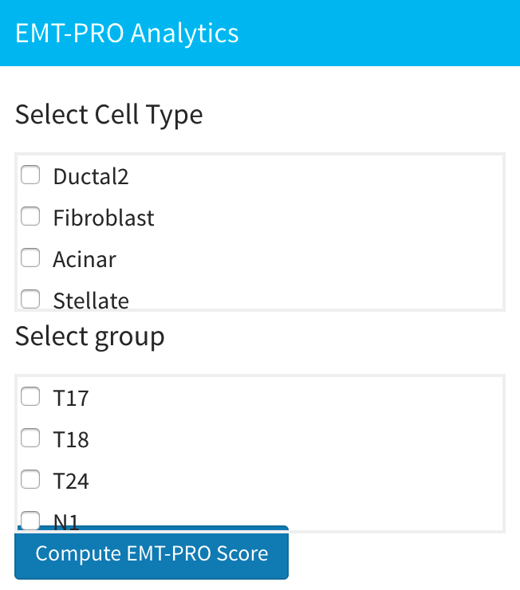

# Epithelial-mesenchymal transition-proliferative (EMT-PRO) Analysis

## Introduction

You can find this analysis in the "Gene Expression" section. EMT-PRO analysis can help you characterize epithelial-to-mesenchymal transition (EMT) and proliferative (PRO) phenotypes for specific cell types in design or test conditions if such conditions are provided.  

First, you need to select which cell type and which design or test group you want to analyze. Then, click the blue "Compute EMT-PRO score" button to start computation.

After computation, you can see the plot of results on the right. The x-axis is the PRO score and the y-axis is the EMT score. The left plot is the EMT-PRO scatter plot and the plot on the right is the corresponding contour map.

## Data

After computation, you can see one resulting file in your working directory:

* `emt_pro_score.RData`: Saves EMT-PRO results in the data frame variable `emt_pro_score`. The data frame should have three columns. The first and second columns are the EMT and PRO scores respectively, and the third column indicates the cell type for each cell. The number of rows equals the number of cells in the group and cell type selected. If you don't upload group information, the number of rows is the number of cells in the cell type you select.

## Methodology

EMT-PRO analysis in sc2MeNetDrug is done by computing the mean expression for the selected design and determining the cell type of EMT and PRO related genes. The **HALLMARK_EPITHELIAL_MESENCHYMAL_TRANSITION** database is chosen for EMT related marker genes and the **HALLMARK_E2F_TARGETS** database is chosen for PRO related marker genes. After the user selects the design and cell type , the whole data set is normalized based on genes using min-max normalization. Then, intersecting genes in the EMT and PRO related marker genes set are selected and mean scores of all EMT and PRO related genes are calculated as the EMT and PRO scores, respectively.