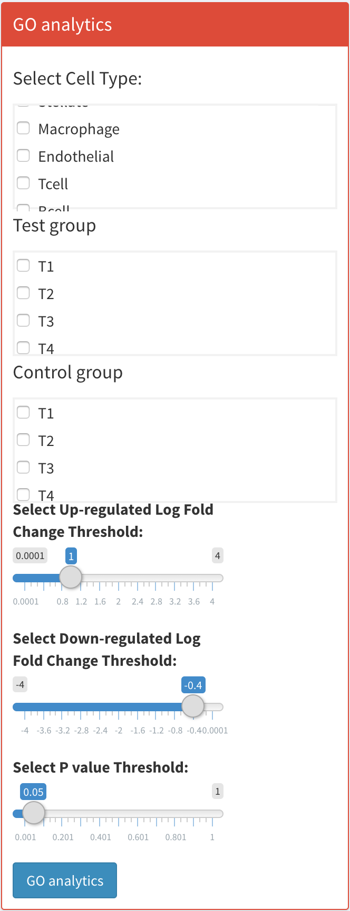
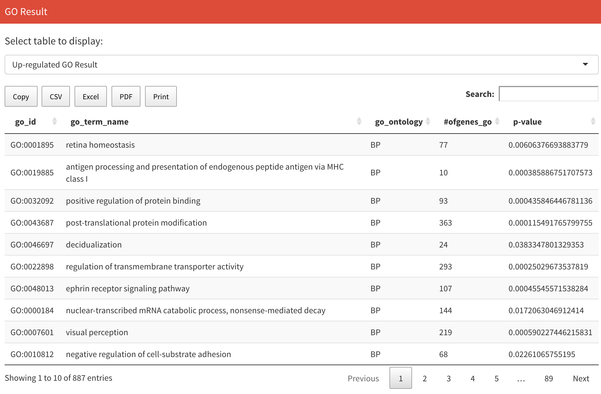
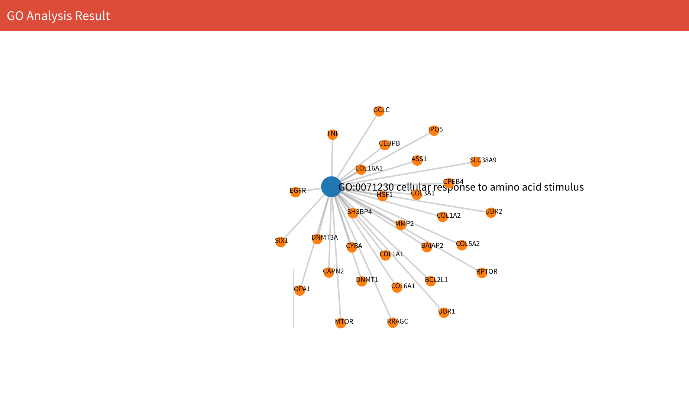

# Gene Ontology (GO) Analysis

## Instruction

You can find GO analysis in the "Gene Expression" section. GO analysis allows you to discover potential gene ontology processes.

First, you need to select the cell type you want to test, set the up-regulated log fold change threshold value, the down-regulated log fold change threshold value and the p-value threshold value as well as the control and test groups, where the test group is the group where the results will be obtained. Then click the blue "GO Analysis" button to start analysis.

<p align="center"></p>


After computation, you can see results table on the right. Results consist of two tables. The first is GO information for up-regulated genes and the second is GO information for down-regulated genes. In the table, the first column is the GO ID, the second column is the GO name, the third column is the type of GO, the fourth column is the number of genes in the GO, and the last column is the p-value. You can switch the two tables on the top.

<p align="center"></p>

On the bottom, you can see the GO and related genes network. **Notice that every time you compute results, you need to select GO once to refresh the network plot, otherwise it may be blank in the network display**.

<p align="center"></p>

## Data

After computation, you will see one file in your working directory:

* `GO_result.RData`: Saves all the data for the GO results in the list variable `GO_result`. The first two data in the list are the up-regulated GO and down-regulated GO tables respectively. The third and fourth data in the list are the dataframes for related genes of up-regulated GO and down-regulated GO respectively. You can obtain them through:

  ```
  up_GO_table<-GO_result[[1]]
  down_GO_table<-GO_result[[2]]
  up_GO_genes<-GO_result[[3]]
  down_GO_genes<-GO_result[[4]]
  ```

## Methodology


