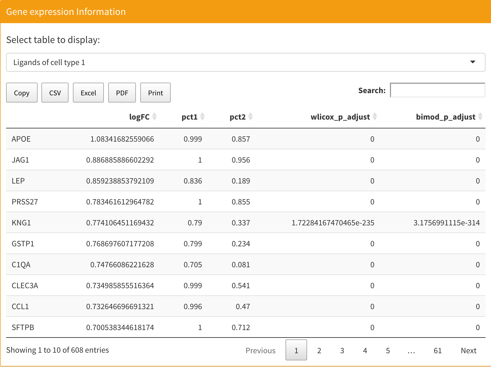
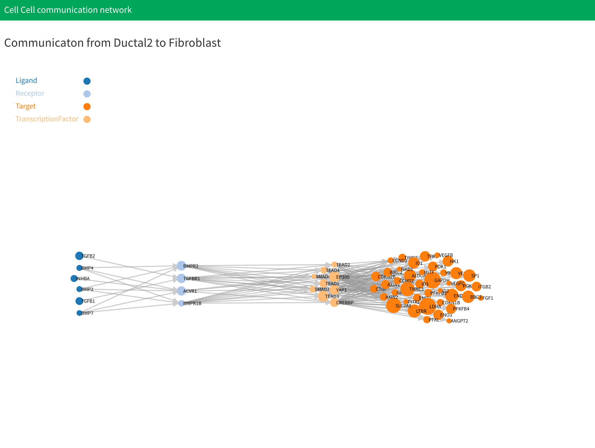

# Cell-Cell communication (downstream network) analysis

## Introduction

You can find the cell-cell comunication analysis in the "Communication and Drug" section. Cell-cell communication (downstream network) allows you to discover ligand-receptor communication between certain cell types and corresponding transcription factors and targets for certain test or design conditions. This analysis is based on the ligand-receptor intercation database. To view the ligand-receptor intercation database, see [Set up](/setup.md).

First, you need to choose which two cell types you want to analyze as well as the test group and control group. Next, choose the up-regulated log fold change threshold, p-value threshold and number of drugs. The number of drugs is related to the drug discovering part. You can find more information in [Drug discovering](signalingDrug.md). If it is the first  analysis run for a certain cell-cell combination, you should check the "Use saved calculation" check box. If you have computed results and want to adjust the threshold, you can check the "Use saved calculation" check box to save the majority of the computations. **Notice that for certain cell-cell combinations, the application will save the latest computaion, which means that if you want to keep the same cell-cell combination but change the test or control group, you need to check the "Use saved calculation" check box**.

The "Only use drug bank drug in drug discovering" check box is related to the drug discovering part. You can find more information in [Drug discovering](signalingDrug.md).

<p align="center"></p>

After computation, you can see the results table on the right. There are four tables that show ligand and receptor information for both cell types. You can select certain tables to be displayed on the top. Each table contains five columns. The first is the log fold change, the second and third columns are expression percentages in the test and control groups respectively. The fourth and fifth columns are Wilcoxon rank sum test adjusted p-values and bimod test adjusted p-values based on the Bonferroni correction.

<p align="center"></p>

The table below is a two network plot. The first network shows the communication from cell type 1 to cell type 2, which means that the ligands are from cell type 1 and the receptors, transcription factors, and targets are from cell type 2. The second network shows the communication from cell type 2 to cell type 1, which means that the ligands are from cell type 2 and the receptors, transcription factors, targets are from cell type 1. The size of the node represents the value of fold change. If the gene has a large fold change, it will have large node in table.

<p align="center"></p>

## Data

All the data for cell-cell commnuications is saved in the cellCommunication directory inside the working directory. Inside the directory, each cell-cell combination will have their own directory to save the results named "CellType1-CellType2". For example, if cell type 1 you selected was "Endothelial" and cell type 2 you selected was "Fibroblast", the directory will be named as "Endothelial-Fibroblast".  If you have more than one cell type in cell type 1 or cell type 2, like "Endothelial" and "Tcell" in cell type 1 and "Fibroblast" in cell type 2, the directory will be named as "Endothelial+Tcell-Fibroblast". Inside the cell-cell combination directory, you can see:

* `genesInformation.RData`: Saves the log fold change and p-value information used for the differential expressed genes test in list variable `genesInformation`. List has four variables, the first is the result for cell type 1 and the second is the result for cell type 2. The third and fourth are  vector variables that indicate what cell type 1 and cell type 2 are. You can obtain them through:

  ```R
  cell_type1_result<-genesInformation[[1]]
  cell_type2_result<-genesInformation[[2]]
  cell_type1<-genesInformation[[3]]
  cell_type2<-genesinformation[[4]]
  ```

  Each result is a data frame with five columns. The first column is the log fold change, the second and third columns are expression percentages in the test and control groups respectively. The fourth and fifth columns are Wilcoxon rank sum test adjusted p-values and bimod test adjusted p-values based on the Bonferroni correction. You can obtain them through:

  ```R
  cell_type1_logFC<-cell_type1_result[,1]
  cell_type1_pct1<-cell_type1_result[,2]
  cell_type1_pct2<-cell_type1_result[,3]
  cell_type1_wlicox_p<-cell_type1_result[,4]
  cell_type1_wlicox_p_adjust<-cell_type1_result[,5]
  cell_type1_bimod_p<-cell_type1_result[,6]
  cell_type1_bimod_p_adjust<-cell_type1_result[,7]
  ```

  For more information about the tables, you can check [Seurat website](https://satijalab.org/seurat/v3.1/de_vignette.html).

* `ligRecInformation.RData`: Saves the log fold change and p-value information for the ligands and receptors in list variable `ligRecInformation`. List has four data frame variabes, they are ligands for cell type 1, receptors for cell type1, ligands for cell type2, and receptors for cell type 2. You can obtain them through:

  ```R
  cell_type1_ligands<-ligRecInformation[[1]]
  cell_type1_receptors<-ligRecInformation[[2]]
  cell_type2_ligands<-ligRecInformation[[3]]
  cell_type2_receptors<-ligRecInformation[[4]]
  ```

  Each data frame has the same structure with the data frame in `genesInformation`, but only the genes that are listed in the ligands or receptors database are kept. 

* "CellType1_CellType2": This directory saves data for cell-cell communication from cell type 1 to cell type 2, where "CellType1" and  "CellType2" are cell types selected by the user. Inside the directory,  you can see:

  * `networkData.RData`:  This file has three variables, the first is `type1_to_type2_result`, which is a list that saves all information for cell-cell communications from cell type 1 to cell type 2. The second and third are `cell_type1` and `cell_type2`, which are vector variables that indicate what cell type 1 and cell type 2 are. `type1_to_type2_result` has three variables inside the list. The first saves the active transcription factors discovered in communication, the second variable saves communication data for up-regulated ligands to expressed receptors, and the third variable saves communication data for expressed ligands to expressed receptors. You can obtain them through:

    ```R
    active_tf<-type1_to_type2_result[[1]]
    upLig_to_expRec_communication<-type1_to_type2_result[[2]]
    expLig_to_upRec_communication<-type1_to_type2_result[[3]]
    ```

    If the analysis doesn't find one communication network, the corresponding network will be `NULL`. If the analysis successfully finds a communication network, each communication data will be a list with four variables. The first is the edge list for the communication network. The second is the receptor to transcription pair for the communication network, and the third is the active pathway discovered in the communication network. The last is all the node information in the communication network. You can obtain them through:

    ```
    communication_network<-upLig_to_expRec_communication[[1]]
    recptor_tf_pair<-upLig_to_expRec_communication[[2]]
    active_pathway<-upLig_to_expRec_communication[[3]]
    communication_nodes<-upLig_to_expRec_communication[[4]]
    ```

  * `networkGraph.RData`: If analysis doesn't find up-regulated ligands to expressed receptors or expressed ligands to up-regulated receptors in the communication network, the file will have three variables named `network_json1`, `cell_type1` and `cell_type2`. The value of `network_json1` will be `NULL` and `cell_type1` and `cell_type2` will be vector variables that indicate what cell type 1 and cell type 2 are. If analysis is successful in finding at least one type of communication network, the file will have five variables named `network_json1`, `network_nodes1`,`network_edges1`, `cell_type1` and `cell_type2`. `network_nodes1` is a data frame that saves all the nodes after combining both types of communication networks. `network_edges1` is a data frame that saves all the edges after combining both types of communication networks. `network_json1` saves the communication network in `.json` format.  `cell_type1` and `cell_type2` are vector variables that indicate what cell type 1 and cell type 2 are.   

* "CellType2_CellType1": This directory saves data for cell-cell communication from cell type 2 to cell type 1, where "CellType2" and  "CellType1" are cell types selected by the user. Inside the directory, you can see:

  * `networkData.RData`:  This file has three variables. The first is `type2_to_type1_result`, which is a list that saves all information for cell-cell communication from cell type 1 to cell type 2. The second and third are `cell_type1` and `cell_type2`, which are vector variables that indicate what cell type 1 and cell type 2 are. `type2_to_type1_result` has the same structure as `type1_to_type2_result` which are described above. You can obtain them through:

    ```
    active_tf<-type2_to_type1_result[[1]]
    upLig_to_expRec_communication<-type2_to_type1_result[[2]]
    expLig_to_upRec_communication<-type2_to_type1_result[[3]]
    ```

    Each communication network data has the same structure as the previously described`type1_to_type2_result`.

  * `networkGraph.RData`: If analysis doesn't find up-regulated ligands to expressed receptors or expressed ligands to up-regulated receptors in the communication network, the file will have three variables named `network_json2`,  `cell_type1` and `cell_type2`. The value of `network_json2` will be `NULL` and `cell_type1` and `cell_type2` will be vector variables that indicate what cell type 1 and cell type 2 are. If analysis is successful in finding at least one type of communication network, the file will have five variables named `network_json2`, `network_nodes2`,`network_edges2`, `cell_type1` and `cell_type2`. `network_nodes2` is a data frame that saves all the nodes after combining both types of communication networks. `network_edges2` is a data frame that saves all the edges after combining both types of communication networks. `network_json2` saves the communication network in `.json` format.  `cell_type1` and `cell_type2` are vector variables that indicate what cell type 1 and cell type 2 are.   

## Methodology

The cell-cell communication analysis in sc2MeNetDrug is done in several steps. First,  differential genes in each of the two cell types are discovered based on two tests: the Wilcoxon rank sum test, and the Likelihood-ratio test<sup>1</sup>. The genes that have log fold change values larger than the threshold value and adjusted p-values for both tests less than the threshold will be selected as differentially expressed genes. The tests are done by the`FindMarkers` function in the`Seurat` package with parameters set as `test.use="wilcox"` and `test.use="bimod"` for the two tests respectively.  

Next, we discover ligands, receptors and transcript factors using the ligand-receptor interaction database and transcript factor-target interaction database, respectively. Then, we use Kegg pathway data to formalize the network. To be specific, two types of networks will be calculated. The first is the up-regulated ligands to expressed receptors network, and the second is the expressed ligands to up-regulated receptors network. Expressed ligands and receptors are ligands and receptors that have log fold change values larger than 0 and adjusted p-values for both tests that satisfy the user’s settings. Finally, the two networks are combined for the final result.

## References

1. McDavid, A. *et al.* Data exploration, quality control and testing in single-cell qPCR-based gene expression experiments. *Bioinformatics* **29**, 461–467 (2013).