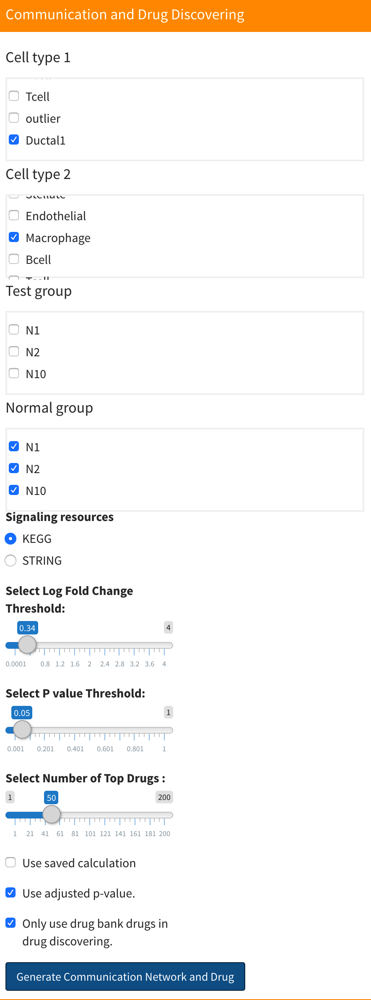

# Signaling Communication Network Discovery-Based on Kegg Signaling Pathways

## Introduction

You can find the signaling communication network Discovery analysis in the "Communication and Drug" section. signaling communication network Discovery analysis allows you to uncover the down-stream signaling of ligand-receptor of interest. Signaling communication network discovery use the ligand-receptor intercation database. To view the ligand-receptor intercation database, see [Set up](/setup.md). 

First, you need to choose which two cell types you want to analyze as well as the test and control groups. Next, choose the up-regulated log fold change threshold, p-value threshold and number of drugs. The number of drugs is related to the drug discovering part. You can find more information in [Drug discovering](signalingDrug.md). If it is the first time to run for a certain cell-cell combination, you should uncheck the "Use saved calculation" check box. If you have computed results and want to adjust the threshold, you can check the "Use saved calculation" check box to save the majority of the computations. **Notice that for certain cell-cell combinations, the application will only save the latest computation, which means that if you want to keep the same cell-cell combination but change the test or control group, you need to uncheck the "Use saved calculation" check box**.

The "Only use drug bank drug in drug discovering" check box is related to the drug discovering part. You can find more information in [Drug discovering](signalingDrug.md).

<p align="center"></p>

After computation, you can see the gene expression information table on the right. There are four tables that show ligand and receptor information for both two cell types. You can select certain tables to be displayed on the top. Each table contains five columns. The first is the log fold change, the second and third columns are expression percentages in the test and control groups respectively, the fourth columns is the Wilcoxon rank sum test adjusted p-values, and the fifth column is bimod test adjusted p-values based on the Bonferroni correction.

<p align="center"></p>

Below the table is network plot result. You can select the plot you want to display in here:


There will have four plot be generated. They are "Activated signaling network of cell type 1", "Activated signaling network of cell type 2", "Downstream signaling network from cell type 1 to cell type 2" and "Downstream signaling network from cell type 2 to cell type 1". For the first two plot, the genes are labeled by the signaling pathway genes belong to. Notice that if there are more than 15 signaling pathway be activated, we will only display the first 15 signaling pathways. The last two plots are downstream  signaling network. The genes are labeled by its type. For each plot, the size of node denote the fold change of genes. The larger nodes mean the higher fold change.


## Data

All the data generated in analysis is saved in the cellCommunication directory inside the working directory. Inside the directory, each cell-cell combination will have their own directory to save the results named "CellType1-CellType2". For example, if cell type 1 was "Endothelial" and cell type 2 was "Fibroblast", the directory will be named as "Endothelial-Fibroblast".  If you selected more than one cell type in cell type 1 or cell type 2 during analysis, like "Endothelial" and "Tcell" in cell type 1 and "Fibroblast" in cell type 2, the directory will be named as "Endothelial+Tcell-Fibroblast". Inside the cell-cell combination directory, you can see:

* `genesInformation.RData`: Saves the log fold change and p-value information used for the differential expressed genes test in list variable `genesInformation`. List has four variables, the first is the result for cell type 1 and the second is the result for cell type 2. The third and fourth are  vector variables that indicate what cell type 1 and cell type 2 are. You can obtain them through:

  ```R
  cell_type1_result<-genesInformation[[1]]
  cell_type2_result<-genesInformation[[2]]
  cell_type1<-genesInformation[[3]]
  cell_type2<-genesinformation[[4]]
  ```

  Each result is a data frame with five columns. The first is the log fold change, the second and third columns are expression percentages in the test and control groups respectively, the fourth columns is the Wilcoxon rank sum test adjusted p-values, and the fifth column is bimod test adjusted p-values based on the Bonferroni correction. You can obtain them through:

  ```R
  cell_type1_logFC<-cell_type1_result[,1]
  cell_type1_pct1<-cell_type1_result[,2]
  cell_type1_pct2<-cell_type1_result[,3]
  cell_type1_wlicox_p<-cell_type1_result[,4]
  cell_type1_wlicox_p_adjust<-cell_type1_result[,5]
  cell_type1_bimod_p<-cell_type1_result[,6]
  cell_type1_bimod_p_adjust<-cell_type1_result[,7]
  ```

  For more information about the tables, you can check [Seurat website](https://satijalab.org/seurat/v3.1/de_vignette.html).

* `ligRecInformation.RData`: Saves the log fold change and p-value information for the ligands and receptors in list variable `ligRecInformation`. List has four data frame variables, they are ligands for cell type 1, receptors for cell type1, ligands for cell type2, and receptors for cell type 2. You can obtain them through:

  ```R
  cell_type1_ligands<-ligRecInformation[[1]]
  cell_type1_receptors<-ligRecInformation[[2]]
  cell_type2_ligands<-ligRecInformation[[3]]
  cell_type2_receptors<-ligRecInformation[[4]]
  ```

  Each data frame has the same structure with the data frame in `genesInformation`, but only the genes that are listed in the ligands or receptors database are kept. 

* `activatedNetworkData1.RData` : Saves the data for activated signaling network of cell type 1.  Data have three variables, The first variable is `activated_network_nodes1`, which save information for all the nodes in the generated network.  The variable is a data frame with four columns. The first column is the id for each gene. The second column is the gene symbol for each gene. The third column is the signaling pathway genes belong to. The final column is the size of each gene used for display. The second variable is `activated_network_edges1`, which save edge data for all the nodes in the generated network. The variable is a data frame with two columns. The first column is source of each edge and the second column is target of each edge. The final variable is `cell_type1` save the cell type of corresponding network.

* `activatedNetworkData2.RData` : Saves the data for activated signaling network of cell type 2.  Data have three variables, The first variable is `activated_network_nodes2`, which save information for all the nodes in the generated network.  The variable is a data frame with four columns. The first column is the id for each gene. The second column is the gene symbol for each gene. The third column is the signaling pathway genes belong to. The final column is the size of each gene used for display. The second variable is `activated_network_edges2`, which save edge data for all the nodes in the generated network. The variable is a data frame with two columns. The first column is source of each edge and the second column is target of each edge. The final variable is `cell_type2` save the cell type of corresponding network.

* "CellType1_CellType2": This directory saves data for downstream signaling network from cell type 1 to cell type 2, where "CellType1" and  "CellType2" are cell types selected by the user. Inside the directory,  you can see:

  * `downstreamNetworkData.RData`: Saves  the data for downstream signaling network from cell type 1 to cell type 2. Data have four variables, The first variable is `downstream_network_nodes1`, which save information for all the nodes in the generated network.  The variable is a data frame with four columns. The first column is the id for each gene. The second column is the gene symbol for each gene. The third column is the type genes belong to. The final column is the size of each gene used for display. The second variable is `downstream_network_edges1`, which save edge data for all the nodes in the generated network. The variable is a data frame with two columns. The first column is source of each edge and the second column is target of each edge. The final two variable are `cell_type1` and  `cell_type2` save the cell type of corresponding network.

* "CellType2_CellType1": This directory saves data for downstream signaling network from cell type 2 to cell type 1, where "CellType2" and  "CellType1" are cell types selected by the user. Inside the directory, you can see:

  * `downstreamNetworkData.RData`: Saves  the data for downstream signaling network from cell type 2 to cell type 1. Data have four variables, The first variable is `downstream_network_nodes2`, which save information for all the nodes in the generated network.  The variable is a data frame with four columns. The first column is the id for each gene. The second column is the gene symbol for each gene. The third column is the type genes belong to. The final column is the size of each gene used for display. The second variable is `downstream_network_edges2`, which save edge data for all the nodes in the generated network. The variable is a data frame with two columns. The first column is source of each edge and the second column is target of each edge. The final two variable are `cell_type1` and  `cell_type2` save the cell type of corresponding network.


## Methodology

The signaling communication network discovery analysis based on kegg signaling pathways in sc2MeNetDrug is done in several steps. First,  differential expressed genes in each of the two cell types are discovered based on two tests: the Wilcoxon rank sum test, and the Likelihood-ratio test<sup>1</sup>. The genes that have log fold change values larger than the threshold value and adjusted p-values for both tests less than the threshold will be selected as differentially expressed genes. The tests are done by the`FindMarkers` function in the`Seurat` package with parameters set as `test.use="wilcox"` and `test.use="bimod"` for the two tests respectively.  

Next, The activated signaling network for each cell type is discovered by using the differential expressed genes for corresponding  cell type and kegg signaling pathway data. For detailed method, please see the sc2MeNetDrug paper. Then, the downstream signaling network from cell type 1 to cell type 2 is generated by first filter the activated signaling network in cell type 2 and only save the network that have genes in our ligand-receptor interaction database. Next, We find all the differential expressed ligands in the cell type1. Finally, we link the ligands in cell type 1 and corresponding receptors in filtered activated signaling network of cell type 2 using ligand-receptor interaction database.

## References

1. McDavid, A. *et al.* Data exploration, quality control and testing in single-cell qPCR-based gene expression experiments. *Bioinformatics* **29**, 461–467 (2013).