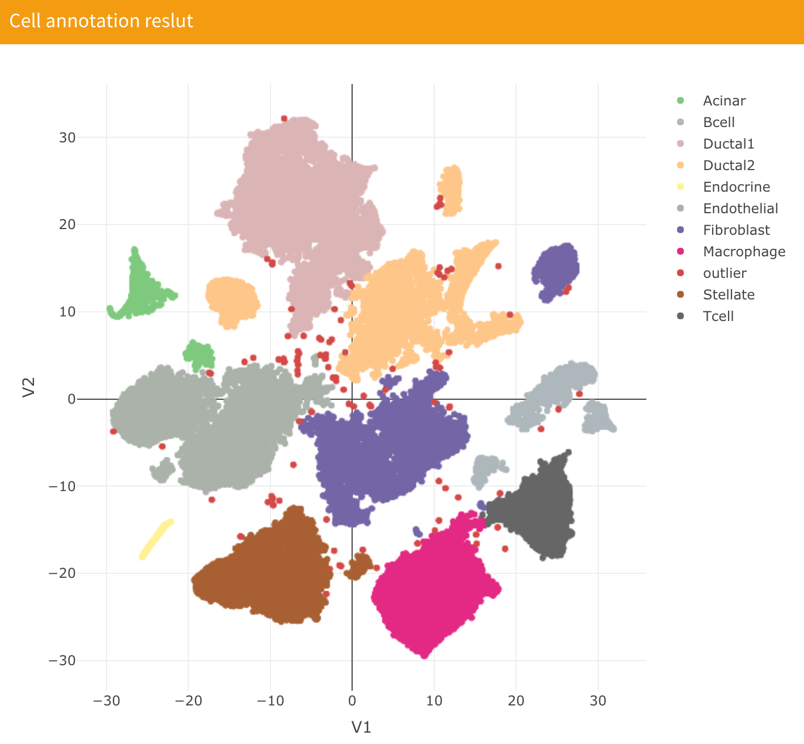

# Cell Annotation

## Introduction

This part is only available after you upload data in the "Upstream analysis Data" part and finish clustering analysis. Cell annotation allows you to annotate cell type for each cell sample in the dataset based on clustering results and expression information. Before doing the cell annotation analysis, you need to select a candidate cell type in the bottom right of the "Biomarker Gene" section:

The cell type for each cell will only be chosen from the cell type you selected. We also provide common cell type combinations for Alzheimer's disease and Pancreatic cancer, and you can use it directly by clicking the blue buttons labeled "Alzheimer's disease" or "Pancreatic cancer".

After you select the cell type list, you can click the blue button "Cell Annotation" in the cell annotation section. Meanwhile, you can choose to use main clustering results or sub-clustering results to do cell annotation by checking or unchecking the "Use sub-clustering result" check box.

After computation, you can see the results of cell annotation in :

We also provide cell annotation result for each cluster:

## Data

After cell annotation, you will get three `.RData` files in your working directory:

* `annotation_es.RData` : This file saves the enrichment score result for each cluster in each cell marker gene set in a data frame variable named as `annotation_es`, where each column represents each cell and each row represents each cluster.
* `annotation_result.RData`: Saves classification results for each cluster in a data frame variable named as `annotation_result` . The first column is the cluster, the second column is the corresponding cell type and the third column is the combination of cluster and cell type used for visualization.
* `cell_annotation.RData`: This file saves the cell type for each cell in a data frame variable named as `cell_annotation`. 

## Video Demonstration

<iframe width="700" height="485" src="https://www.youtube.com/embed/Ssd2Rg8Zf_g" frameborder="0" allow="accelerometer; autoplay; clipboard-write; encrypted-media; gyroscope; picture-in-picture" allowfullscreen></iframe>

## Methodology

Cell annotation in sc2MeNetDrug is computed using Gene Set Enrichment Analysis (GSEA)1. After the user selects candidate cell types in the "Biomarker Gene" section and starts computation, the application will compute the log fold change for cluster \(N​\) using the following formula:
\\[\text{log fold change for cluster N}=\text{mean expression for cluster N}-{\text{mean expression for other cells}}\\]

Then we order the genes based on log fold changes as genes rank and compute enrichment scores of marker gene sets for each candidate cell type. Finally, the cell type with the largest enrichment score will be selected as the type of this cluster. However, if none of the cell types have a positive enrichment score, the cluster will be annotated as unknown. 

## References

1. Subramanian, A. *et al.* Gene set enrichment analysis: A knowledge-based approach for interpreting genome-wide expression profiles. *Proc. Natl. Acad. Sci.* **102**, 15545 LP – 15550 (2005).