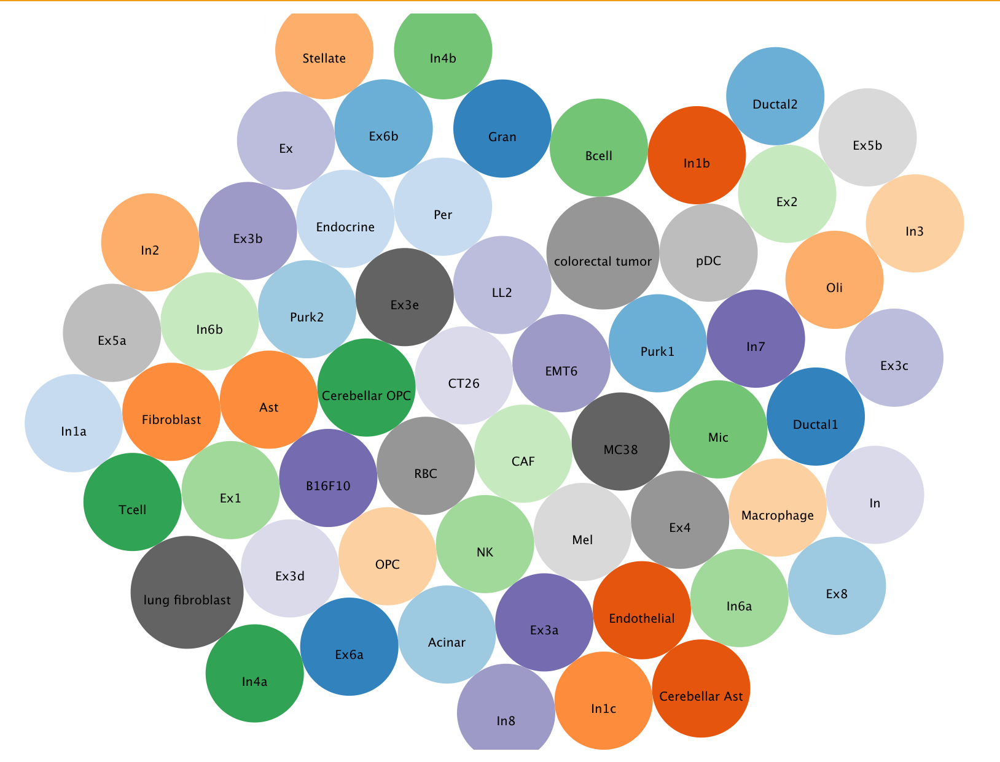
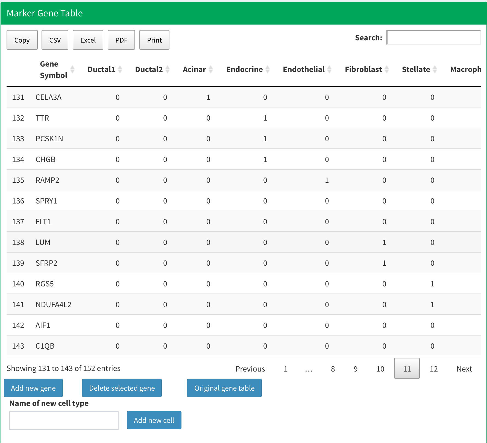

# Biomarker Gene

## Introduction

To perform cell annotation, marker genes for each cell type are essential. We have gathered biomarker genes for over 50 distinct cell types.

You can view the detailed gene list for each cell type by clicking on the bubble in the plot, or you can locate them in the provided table:

Each row is a cell-marker gene pair. 

### Edit Marker Gene Table

Since this marker gene table will be used in the cell annotation section, we provide user with interface to add or modify the marker gene database based on their on scRNA dataset.

* **To delete an existing cell-marker gene pair**: You can do it by first click the corresponding row in the marker gene table. Then, click "Delete selected gene" button to delete this row.
* **To add new cell-marker gene pairs**: Use the bottom right panel. Begin by entering the cell type name in the first input box. Next, select the marker genes you wish to add from the second input box. You can choose multiple genes simultaneously. Lastly, click "add new gene" to incorporate them into the marker gene table.
* **Modify an existing cell-marker gene pair**: You can directly double-click the table cell in the marker gene table to modify it.

### Save Edited Marker Gene Table

After making modifications, you can save the updated marker gene table for future use. Once you've edited the table, click the blue "Save current marker gene table" button. The revised table will be saved to the working directory as markerGeneTable.RData. In subsequent sessions, if you work from the directory containing the saved markerGeneTable.RData, the application will load your saved data instead of the default table.
