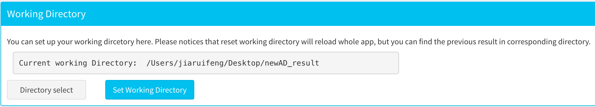
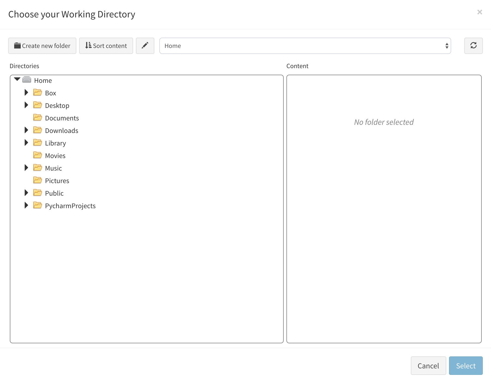
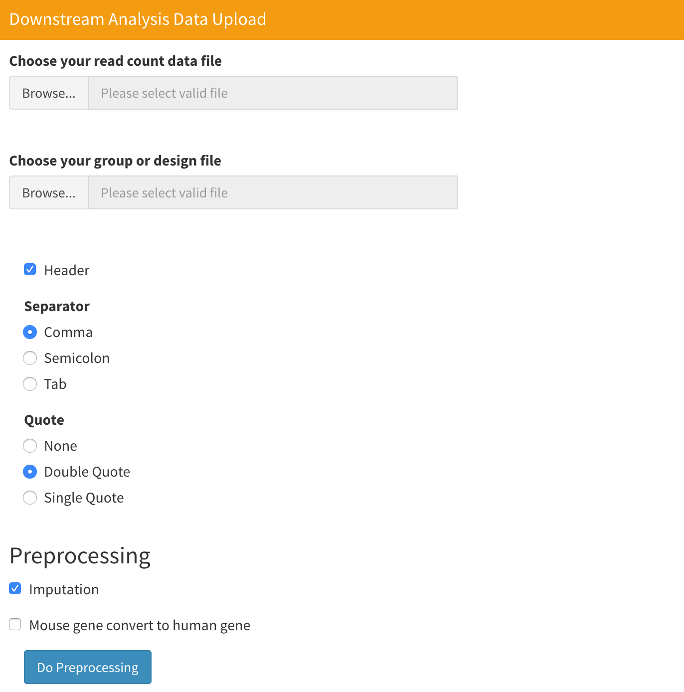

# Working Directory and Data Upload

## Set Working Directory

<p align="center"></p>

Before you upload your data, you should first select a working directory, where all the results will be saved. Note that if you have multiple datasets  to analyze, you should set different working directories for each dataset, otherwise new results will automatically overwrite the previous results. All the results are saved in `.RData` format, which makes it easy for the application to reload it, but you can also save data in other formats inside the application.

To set a working directory, first click the grey button "Select Working Directory".

<p align="center"></p>

Then, the above interface should be displayed and you can click the directory you want to choose on the left side. After you choose a directory, click "Select". Finally, click the blue button "Set Working Directory" to change the working directory in the application. Once you see the directory you choose displayed in application, you have successfully set the directory. Notice that after you set or reset the directory, all the previous data and results loaded in the application will be unloaded and the whole application will be reinitialized. 

In docker version, the docker environment will be show in default. But you can find the mount directory of you local computer in the directory list once you run the docker version with local directory mounting. For more information, please see [docker installation](./installation.md)

## Upload Data

 After you select a working directory, you can upload your data. Currently, we accept RDS and csv files. If you only have read count data, you should upload your data in the "Upstream analysis" part. RNA-seq read count data should be a dataframe with each row representing each gene and each column representing each cell. The row name of the dataframe should be the gene symbol. If you have a column name for your dataset, you should check the "Header" checkbox below "Choose your group or design file". Notice that we only accept files with sizes less than 5GB.

<p align="center"></p>

Group or design file is used to assign each cell sample with a experimental condition, which is an optional choice, but we recommend you upload it in order to obtain reasonable analysis results. The file should be a csv or RDS file, and the data should be a data frame with only one column. The length of the row should be equal to the number of cells in the read count data. **Please don't include the row name in your data**. 

<p align="center"></p>

If you have cell annotation results(which means you know what cell type is for each cell sample), you can upload your data in the "Downstream analysis data" part. RNA-seq read count data in this part has the same format as that in the "Upstream analysis" part. But in the cell type and group file upload, you should upload a file with your cell annotation information for each cell sample. The file should have one or two columns. The first column should be your cell annotation result and the second column should be your group or design information, which is optional. Similarly, **don't include the row name in your data**. 

Here we provide you with a sample script about how to process data file and generate RDS file used for upstream analysis data uploading:

```R
library(Matrix)

#Read data in to memory
data<-readMM("read_count_matrix.mtx")

#Read gene symbol data
genes<-read.csv("genes.tsv",sep="\t",header = 0)

#Read barcode data, this is optional
barcode<-read.csv("barcodes.tsv",sep="\t",header = 0)

#Convert data to matrix format
data<-as.matrix(data)

#Assign gene symbol to data matrix
rownames(data)<-genes$gene_symbol
colnames(data)<-barcode$V1

#Check and remove all duplicated gene from data
#Here we will retain the gene that have maximum variance among all data that have same gene symbol
gene_variance<-apply(data,1,var)
data<-data[order(gene_variance,decreasing=T),]
data<-total_data[!duplicated(e10_gene$V2),]

#Finally, save data as RDS file
saveRDS(data,file="data.RDS")

#generate group or design file for upstream analysis
#This is just fake data that is used to give you a sense about the format of group file.
#Here, number of row in group list(num_group1+num_group2) must be equal to the cell in read count data
group_list<-as.character(c(rep("group1",num_group1),rep("group2",num_group2)))
group_list<-data.frame(group_list)
saveRDS(group_list,file="group.RDS")
```

## Process Drug File 

In the cell-cell communication and drug discovering analysis, sc2MeNetDrug needs a Connectivity Map database in order to build a drug rank matrix. However, since we cannot directly include this data in sc2MeNetDrug, the user needs to download raw data from a website. sc2MeNetDrug can help the user to process data and unlock cell-cell communication and drug discovering analyses. You can find more information about the Connectivity Map data [here](https://docs.google.com/document/d/1q2gciWRhVCAAnlvF2iRLuJ7whrGP6QjpsCMq1yWz7dU/edit). 

First, you need to go to the[NCBI website](https://www.ncbi.nlm.nih.gov/geo/query/acc.cgi?acc=GSE92742) and download following data:

* `GSE92742_Broad_LINCS_Level5_COMPZ.MODZ_n473647x12328.gctx.gz`
* `GSE92742_Broad_LINCS_gene_info.txt.gz`
* `GSE92742_Broad_LINCS_sig_info.txt.gz`
* `GSE92742_Broad_LINCS_pert_info.txt.gz`

Next, put all data files into one directory. Unzip the data files to create .txt or .gctx files from the .gz formatted files. Open sc2MeNetDrug, find "Drug File Processing" in the "Upload Data" section. Click the "Select Drug File Directory" button and select the directory where you put the data you downloaded. Finally, click the blue button "Process Drug Data" to start processing. After processing, you should unlock cell-cell communication and drug discovering analyses. if not, you can try click "load data" button in "Gene Expression" section or reopen the sc2MeNetDrug. 

We recommend you to process drug file before you load data into sc2MeNetDrug, cause the process will consume large memory and may run out of memory if your computer's memory is not enough.

In Windows or Mac version, **You don't need to process data twice even if you restart the application or change the working directory cause the processed file has already saved**. But in docker container, to appropriately save processed file, you need to commit the change in container and build a new local image. To do that, after drug file processing finish, close the docker container and run following code in terminal:

```
docker ps -l
```

Then, you will see all the containers that have changed. Find the sc2MeNetDrug and corresponding `CONTAINER ID`. Next, run following code in terminal:

```
docker commit CONTAINER_ID fuhaililab/sc2menetdrug
```

Where `CONTAINER_ID` is the container id you find. 


## Video Demonstration

<iframe width="700" height="485" src="https://www.youtube.com/embed/i9_HH_Klwt8" frameborder="0" allow="accelerometer; autoplay; clipboard-write; encrypted-media; gyroscope; picture-in-picture" allowfullscreen></iframe>