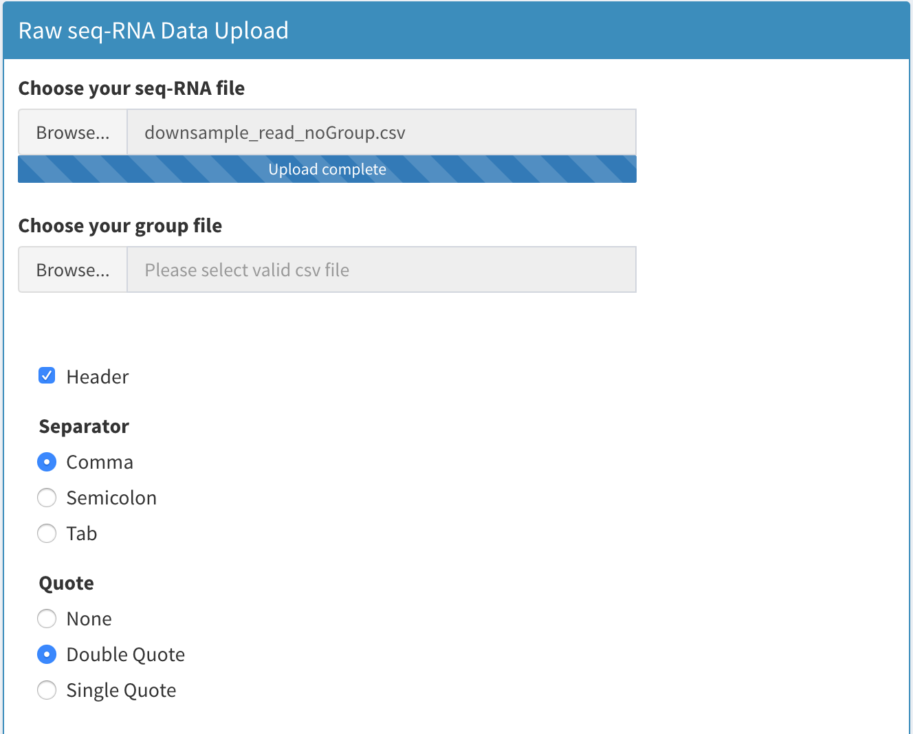

# Setting the Working Directory and Uploading Data

## Set Working Directory

<p align="center"></p>

Before uploading your data, you should first select a working directory where all the results will be saved. Please note that if you have multiple datasets to analyze, it's essential to set different working directories for each dataset; otherwise, new results will automatically overwrite the previous ones. All the results are saved in the .RData format, which makes it easy for the application to reload them, but you can also save data in other formats within the application.

To set a working directory, click the gray "Select Working Directory" button in the top of "Upload Data" section.

<p align="center"></p>

Next, the above interface should be displayed, and you can click on the directory you want to select from the left side. Once you've chosen a directory, click "Select." Finally, click the blue "Set Working Directory" button to change the working directory in the application. When you see the chosen directory displayed in the application, you have successfully set the directory. Please note that after you set or reset the directory, all the previous data and results loaded in the application will be unloaded, and the entire application will be reinitialized.
## Upload Data

<p align="center"></p>

1. After you select a working directory, you can upload your scRNA-seq data. For read count data, we only accept `.RDS` file contains dgCMatrix or Seurat object, or `.csv` files.

2. If you don't have cell annotation results, you should upload your data in "Uploading Upstream Analysis Data" part in order to perform upstream analysis to get cell annotation results. 

3. RNA-seq read count data should be in the form of a sparse matrix or dataframe, where each row represents a gene, and each column represents a cell. The row names of the matrix should correspond to the gene symbols. If your dataset includes column names, please check the "Header" checkbox located below "Choose your group or design file".

4. The group or design file is used to assign each cell sample to an experimental condition, and while it's optional, we recommend uploading it to obtain meaningful analysis results. This file should be in CSV or RDS format and should consist of a single-column data frame. The number of rows in this file should be equal to the number of cells in the read count data. Please ensure that you do not include row names in your data.

    <p align="center"></p>

5. If you have cell annotation results (meaning you already know the cell type for each cell sample), you can upload your data in the "Uploading Downstream Analysis Data" section. The requirements for RNA-seq read count data are the same as in the "Upstream Analysis" section. However, when uploading the cell type and group file, you should provide a file containing your cell annotation information for each cell sample, along with the optional group or design information. This file should consist of one or two columns. The first column should contain your cell annotation results, and the second column, if included, should contain your group or design information. As with previous uploads, please do not include row names in your data.

6. Currently, we only accept files with sizes less than 8GB to avoid memory issue. But you can change it if you want to upload large file in `server.R` by changing:
    `options(shiny.maxRequestSize = 8000 * 1024 ^ 2)`


Here, we provide you with a sample R script demonstrating how to process data files and generate an RDS file for upstream analysis data uploading:

```R
library(Matrix)

# Read data in to memory
data<-as.matrix(readMM("read_count_matrix.mtx"))

# Read gene symbol data
genes<-read.csv("genes.tsv",sep="\t",header = 0)

# Read barcode data, this is optional
barcode<-read.csv("barcodes.tsv",sep="\t",header = 0)

# Assign gene symbol to data matrix
rownames(data)<-genes$gene_symbol
colnames(data)<-barcode$V1

# Check and remove all duplicated gene from data
# Here we will retain the gene that have maximum variance among all data that have same gene symbol
gene_variance<-apply(data,1,var)
data<-data[order(gene_variance,decreasing=T),]
data<-data[!duplicated(genes$V2),]

# Convert data to dgCMatrix format
data<-Matrix(data, sparse=TRUE)

# Finally, save data as RDS file
saveRDS(data,file="data.RDS")

# Generate group or design file for upstream analysis
#This is just fake data that is used to give you a sense about the format of group file.
# Here, number of row in group list(num_group1+num_group2) must be equal to the cell in read count data
group_list<-as.character(c(rep("group1",num_group1),rep("group2",num_group2)))
group_list<-data.frame(group_list)
saveRDS(group_list,file="group.RDS")
```

## Process Drug File 

For cell-cell communication and drug discovery analysis, sc2MeNetDrug requires a Connectivity Map database to construct a drug ranking matrix. As we can't include this data directly into sc2MeNetDrug, users must download the raw data from a website. sc2MeNetDrug then assists users in processing this data, enabling cell-cell communication and drug discovery analyses. More details about the Connectivity Map data are available [here](https://docs.google.com/document/d/1q2gciWRhVCAAnlvF2iRLuJ7whrGP6QjpsCMq1yWz7dU/edit). 

1. First, go to the [NCBI website](https://www.ncbi.nlm.nih.gov/geo/query/acc.cgi?acc=GSE92742) and download the following data:

   * `GSE92742_Broad_LINCS_Level5_COMPZ.MODZ_n473647x12328.gctx.gz`
   * `GSE92742_Broad_LINCS_gene_info.txt.gz`
   * `GSE92742_Broad_LINCS_sig_info.txt.gz`
   * `GSE92742_Broad_LINCS_pert_info.txt.gz`

2. Place all data files in a single directory. Extract the .gz files to obtain .txt or .gctx files. Launch sc2MeNetDrug and go to the "Upload Data" section. Under "Drug File Processing", click "Select Drug File Directory" and choose the directory containing your downloaded data. Then, hit the "Process Drug Data" button. Once processed, cell-cell communication and drug discovery analyses should be available. If not, click the "load data" button in the "Gene Expression" section or restart sc2MeNetDrug.

3. We recommend processing the drug file before loading data into sc2MeNetDrug, as the process can consume significant memory. If your computer has limited memory, it may run out during this step.

4. You only need to process the drug file once. After processing, it's saved in the application directory and remains available for future use.

## Video Demonstration

<iframe width="700" height="485" src="https://www.youtube.com/embed/i9_HH_Klwt8" frameborder="0" allow="accelerometer; autoplay; clipboard-write; encrypted-media; gyroscope; picture-in-picture" allowfullscreen></iframe>