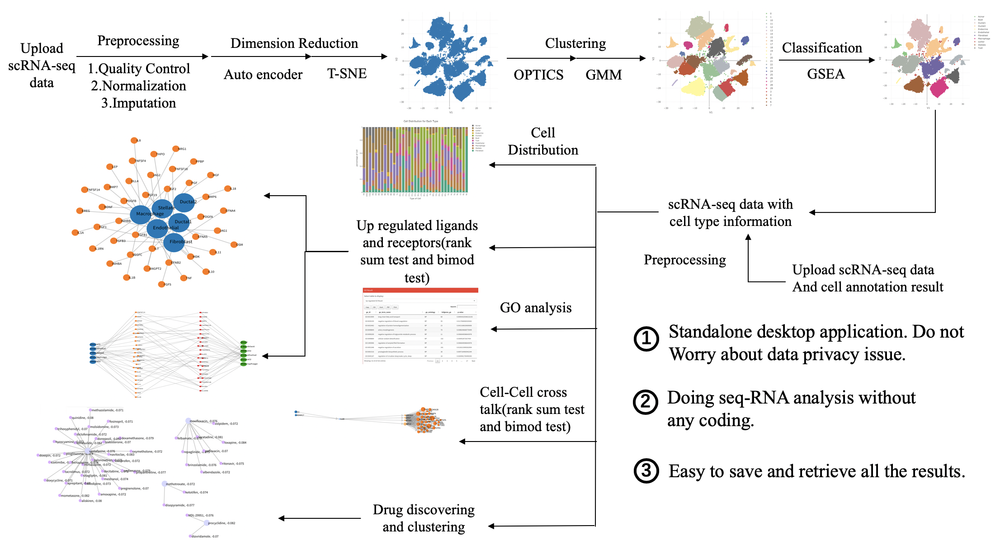

# sc2MeNetDrug

Single cell RNA sequence (scRNA-seq) data analysis has developed rapidly in recent years. Various analysis methods and theories that can give insight into the complex biological processes inside both animals and humans. However, a thorough analysis of scRNA-seq data always requires multiple steps, and the results of the previous step influence the results in next step, which makes analysis especially diffcult. Moreover, the majority of tools and packages used for scRNA-seq data only include part of the analysis steps, which means researchers need to download many packages and familiarize themselves with the different packages. Here we introduce sc2MeNetDrug, a tool that help you to analysis scRNA seq data in an efficient, reliable, and convenient way. In this tool, we include **data quality control**, **imputation**, **normalization**, **data dimension reduction**, **cell population clustering**, **cell type annotation**, **upstream network analysis**,**cell-cell communication network analysis**, **drug discovering**, **Gene Ontology analysis** and many other useful methods to analyze scSeq-RNA data. We provide a user-friendly interface, instructions, a powerful visualization tool, and convenient data saving and retrieving methods. In addition, researchers can analysis data without any programming.

[Download](./downloadRequest.md){: .btn .btn-green .ml-auto }

## Overall Workflow

The picture above shows the overall workflow of sc2MeNetDrug. All the analyses done in sc2MeNetDrug can be divided into two parts: upstream analysis and downstream analysis. In upstream analysis, the user can upload read count scRNA-seq data and the application will go through preprocessing, dimension reduction, clustering, and obtain cell annotations for each cell sample in the data set. All downstream analyses can be performed like upstream network analyses, GO analysis, cell-cell communication network analysis, and drug discovery. Meanwhile, if you already have cell annotation results, you can upload it with your read count data to perform downstream analysis directly.

sc2MeNetDrug has seven sections:

* **Upload Data**: In this section, data can be uploaded for upstream and downstream analysis and preprocessing.
* **Dimension Reduction**: Dimension reduction analysis is performed in this section.
* **Clustering**: Main clustering and sub-clustering are performed in this section.
* **Biomarker Gene**: The biomarker gene database can be viewed and edited in this section. 
* **Cell Annotation**: Cell annotation analysis is performed in this section.
* **Gene Expression**: Upstream network analysis, EMT-PRO analysis, and GO analysis can be performed in this section. In addition, you can set up the data set and ligand-receptor database at the top of this section.
* **Communication and Drug**: Cell-cell communication network analysis and drug discovering analysis are performed in this section.

