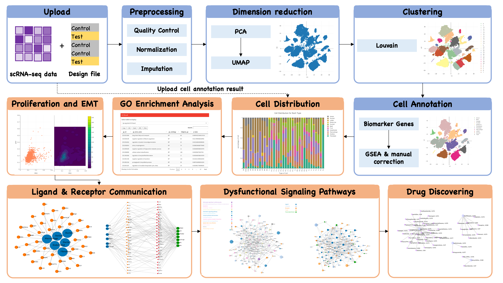

# sc2MeNetDrug

Single-cell RNA sequencing (scRNA-seq) data analysis has rapidly evolved in recent years, offering various methods and theories to gain insights into the complex biological processes in both animals and humans. Although there are many professional tools like Seurat or Scanpy that were developed specifically for analyzing scRNA-seq data. Most of them require advanced knowledge on coding and programming, which is not easy for biomedical researchers. Further, there is no package that can be used to identify inter-cell communication networks, activated signaling pathways, and drugs that can target on these networks. 

We introduce sc2MeNetDrug, a tool designed to facilitate efficient, reliable, and convenient analysis of scRNA-seq data. In this tool, we encompass **data quality control, imputation, normalization, data dimension reduction, cell population clustering, cell type annotation, upstream network analysis, cell-cell communication network analysis, drug discovery, Gene Ontology analysis**, and many other useful methods for analyzing scRNA-seq data. We provide a user-friendly interface, detailed instructions, a powerful visualization tool, and streamlined data-saving and retrieval methods. Additionally, researchers can perform data analysis without the need for programming.

[Installation](installation){: .btn .btn-green .ml-auto }

## Overall Workflow

The picture above illustrates the overall workflow of sc2MeNetDrug. All the analyses conducted in sc2MeNetDrug can be divided into two parts: upstream analysis and downstream analysis.

In the upstream analysis, the user can upload read count scRNA-seq data, and the application will go through preprocessing, dimension reduction, clustering, and obtain cell annotations for each cell sample in the dataset. Once the user obtains the cell annotation results, all downstream analyses can be performed, including upstream network analyses, GO analysis, cell-cell communication network analysis, and drug discovery.

Alternatively, if you already have cell annotation results, you can upload them along with your read count data to perform downstream analysis directly.

sc2MeNetDrug has seven sections:

* **Upload Data**: Upload data for both upstream and downstream analysis and then perform the data preprocessing.
* **Dimension Reduction**: Perform dimension reduction analysis.
* **Clustering**: Perform clustering analysis.
* **Gene Feature Exploration**: Explore the expression patterns of genes to identify biomarker genes for each cluster.
* **Biomarker Gene**: Explore and edit biomarker gene database for cell annotation. 
* **Cell Annotation**: Perform cell annotation analysis.
* **Gene Expression**: Perform upstream network analysis, EMT-PRO analysis, and GO analysis. In addition, you can set up the data set and ligand-receptor database at the top of this section.
* **Communication and Drug**: Perform inter-cell communication network analysis and drug discovering analysis.

