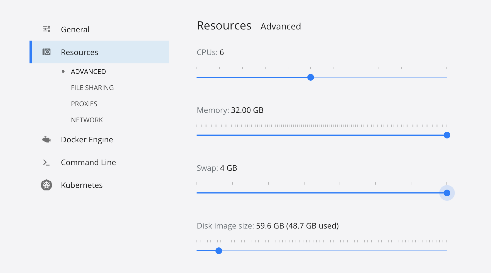

# Installation

Here we provide three ways to run sc2MeNetDrug. Typically, sc2MeNetDrug will consume a large amout of memory when running if the size of scRNA-seq data is large. Regrading the normal size of scRNA-seq data, we suggest you use a computer with at least 16g RAM(32g or more is recommended)

## Docker

We recommend you use Docker installation method if possible. Since we set up all the environments with docker image, you will not need to worry about any environment issues that may happen during installation and running if you use Docker. We provide the installation instructions below, but please help us by filling in the form here [Download](./downloadRequest.md).

1. If you don't have docker environment in your computer, please download docker desktop first in [Docker website](https://www.docker.com). Make sure you set up docker environment appropriately.

2. Open the terminal/CMD, type following code to download sc2MeNetDrug image:

   `docker pull fuhaililab/sc2menetdrug`

3. After downloading, type following code to run the sc2MeNetDrug:

   `docker run -p 5000:5000 -v $HOME:$HOME fuhaililab/sc2menetdrug`

   Notice that we need to mount a computer directory by `-v` when using docker locally. Normally, in Mac, you can just run above code to mount local directory. If you are using Windows, pleast check that you have the `HOME` variable in path. Or, you can mount local directory manually using:

   `docker run -p 5000:5000 -v /C/Users:/Volumes fuhaililab/sc2menetdrug`

   This will mount the local directory `/C/Users` to the Docker container in the directory `Volumes`. You can find it when you set working directory in sc2MeNetDrug.

   Meanwhile, to make sure sc2MeNetDrug runs appropriately, please set the memory limit and swap to the maximum value in Docker desktop(Mac):

   

   Or you can set it when run the docker image:

   `docker run -p 5000:5000 -m 16g --memory-swap 4g -v /C/Users:/Volumes fuhaililab/sc2menetdrug`

   Where `-m` is the memory limit and `--memory-swap` is the amount of memory is allowed to swap to disk.

## Desktop Application

### Prerequisite

In order for the sc2MeNetDrug app to run well on your Laptop/PC, you need to have a **JAVA environment** installed in your system. If you haven't install it yet, you can find it in [JAVA Website](https://www.java.com/). In addition, you need to have a **Python environment** and the **tensorflow package** installed in your **default Python environment**. If you haven't install it yet, we recommend you install Python through anaconda. You can find it in [Anaconda](https://www.anaconda.com), then install the tensorflow package through by `pip install tensorflow` in terminal. The default Python environment refers to the Python environment that is listed in environment path. This is very important especially when your computer has more than one python environment.

### For Mac

1. Download the `.dmg` file from the link.

2. Open the `.dmg` file and drag the sc2MeNetDrug application to the desired location.

3. Before opening the application, make sure you have `gcc` downloaded. If not, you can download `gcc` by following these steps: 

   1. Open terminal and run the following code to install `homebrew`:

   `/bin/bash -c "$(curl -fsSL https://raw.githubusercontent.com/Homebrew/install/master/install.sh)"`

   2. Run the following code to install `gcc`:`brew install gcc`.

4. When opening the application for the first time, you may need to hold `^control`, click the application, click open, and go through verification for the application to open.

### For Windows

1. Download the `zip ` file from Github.
2. Unzip it and put it in the desired location.
3. Find `sc2MeNetDrug.exe` and click to open the application.

## Video Demonstration

This video demonstrates how to download sc2MeNetDrug using Docker.

<iframe width="700" height="485" src="https://www.youtube.com/embed/b4R14UBssLM" frameborder="0" allow="accelerometer; autoplay; clipboard-write; encrypted-media; gyroscope; picture-in-picture" allowfullscreen></iframe>

