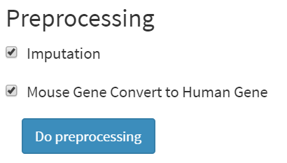

# Preprocessing

## Introduction

After successfully uploading the required data, you can proceed with the preprocessing analysis. This step enables quality control, normalization, and imputation of the read count dataset. While imputation is optional, it's more time-consuming and can consume a significant amount of memory, potentially leading to out-of-memory errors on machines with limited resources. Please ensure that if you have a group or design file, it's uploaded before initiating preprocessing.

<p align="center"></p>

To perform imputation, tick the "imputation" checkbox. If your RNA-seq data is derived from mice, select "Mouse Gene Convert to Human Gene" to convert mouse gene symbols to human equivalents. Afterward, click the blue "Do preprocessing" button to begin. Once preprocessing is complete, results will appear at the top of the application:
<p align="center"></p>

## Data

After preprocessing, you'll find at least one .RData files in your working directory. If you uploaded data under the "Upstream Analysis data" section, you will have:

* `rna_df.RData`: Saves the read count data in a Seurat object after preprocessing. The name of variable is `data`.  Data in matrix format can be obtained from the Seurat object through:

  ```R
  # If you don't do imputation in preprocessing
  data[["RNA"]]@data
  # If you do imputation in preprocessing
  data[["alra"]]@data
  # If you are not sure which one, you can just call
  data[[seurat_data@active.assay]]@data
  ```

  For more information, please see documents in [Seurat Website](https://satijalab.org/seurat/).

* `rnaGroupInformation.RData`: If you upload group or design information, this file will save this information after preprocessing in a variable named `group_list`.

If you upload data in the "Downstream Analysis Data" part, you will have:

* `network_df.RData` Saves the read count data in a Seurat object after preprocessing. The name of this variable is `data`. 
* `networkGroupInformation.RData`: If you upload group or design information, this file will save this information after preprocessing with the variable named `group_list`.


## Video Demonstration

<iframe width="700" height="485" src="https://www.youtube.com/embed/kH4FJPaxWUc" frameborder="0" allow="accelerometer; autoplay; clipboard-write; encrypted-media; gyroscope; picture-in-picture" allowfullscreen></iframe>

## Methodology

The preprocessing of scRNA-seq read count data in sc2MeNetDrug involves three steps: quality control, normalization, and imputation.
### Quality Control

Quality control is conducted in stages. Initially, cells with a detected gene count of less than 200 or more than 7500 are removed. Subsequently, cells with abnormal mitochondrial gene expression (cells with >10% mitochondrial counts) are also eliminated.
### Normalization

To normalize scRNA-seq read count data, we use `sctransform` function with `glmGamPoi` method provided in Seurat package. you can find more information about it in [Seurat Vignettes](https://satijalab.org/seurat/articles/sctransform_vignette).

### Imputation

Imputation is carried out using the runALRA function from the Seurat package with default settings. This method<sup>1</sup> calculates the k-rank approximation for A_norm and modifies it based on the error distribution derived from negative values.

## Advanced Hyper-parameter Tuning
All main functions used in preprocessing module can be located in `R/preprocessing.R`. Users can adjust all hyper-parameters used in preprocessing in this file.

For quality control, locate the following line in the file:
```R
seurat_data <- subset(seurat_data, subset = nFeature_RNA > 200 & nFeature_RNA < 7500 & percent.mt < 10)
```

To change the criteria for cell quality control to: cells with a detected gene count of less than 300 or more than 3000, cells with >5% mitochondrial counts are removed, users can modify the above code to:
```R
seurat_data <- subset(seurat_data, subset = nFeature_RNA > 300 & nFeature_RNA < 3000 & percent.mt < 5)
```
To include other criteria, please check [Seurat documents](https://satijalab.org/seurat/) for more information. 

For imputation, locate the following main function in the file:
```R
seurat_data <- RunALRA(seurat_data, assay = seurat_data@active.assay)
```
Please see [examle](https://github.com/satijalab/seurat-wrappers/blob/master/docs/alra.md) and [document](https://www.rdocumentation.org/packages/Seurat/versions/3.1.4/topics/RunALRA) for more information and parameters used in the imputation.
Users can modify the parameters used in imputation by adjust the above function. Make sure to keep `assay = seurat_data@active.assay` to allow the imputation to be computed in the correct dataset.

**Importance:** After modifying the file, please make sure to restart the application to let modified parameters to be effective.

## References

1. Linderman, G. C., Zhao, J. & Kluger, Y. Zero-preserving imputation of scRNA-seq data using low-rank approximation. *bioRxiv* 397588 (2018) doi:10.1101/397588.


