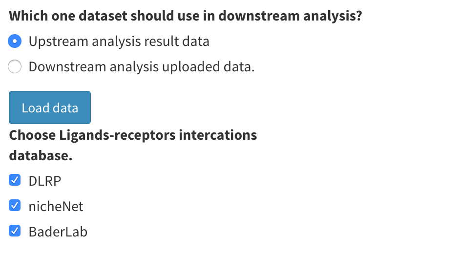

# Gene Expression, Communication and Drug Discovering (Downstream Analysis)

This section becomes accessible either after uploading data in the "Upstream Analysis Data" and completing the cell annotation phase, or after uploading both read count data and cell annotation results in the "Downstream Analysis Data" section.

1. First, determine the data set you wish to use for the downstream analysis. Choose "Upstream analysis result data" to utilize the read count data and cell annotation results from the upstream analysis. If you prefer using data you've uploaded, select "Downstream analysis uploaded data" from the "Downstream Analysis Data" section. After making your selection, click the blue "Load data" button to confirm. **Be aware that this choice will apply to all subsequent downstream analyses**.

    <p align="center"></p>

2. Next, choose a ligand-receptor interactions database. We currently offer three databases for selection. The database you opt for will be utilized in all subsequent analyses that require ligand and receptor data.

3. Please note that to conduct cell-cell communication and drug discovery analyses, it's essential to download drug data and carry out preprocessing within the application. More information about this can be found in the [Working Directory Setting and Data Uploading](/data).

4. To conduct a differentially expressed genes test in certain analyses, sc2MeNetDrug will create design information for a `Seurat` object after cell annotation for "Upstream analysis data" or after preprocessing for "Downstream analysis data". If you provide group or design data, the design set for the `Seurat` object will be a combination of the group and cell type. For instance, if a cell is categorized under "group1" and "Endothelial", the design data in the `Seurat` object will be labeled as "Endothelial_group1". If you don't provide group or design data, the `Seurat` object will simply identify the cell type for each cell. You can load data and obtain design information by:

   ```
   library(Seurat)
   Idents(data)
   ```

## Video Demonstration

<iframe width="700" height="485" src="https://www.youtube.com/embed/1yUrm-1OuZw" frameborder="0" allow="accelerometer; autoplay; clipboard-write; encrypted-media; gyroscope; picture-in-picture" allowfullscreen></iframe>