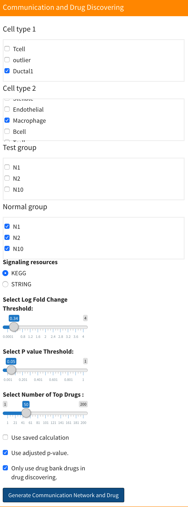
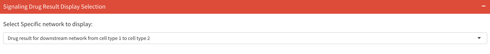
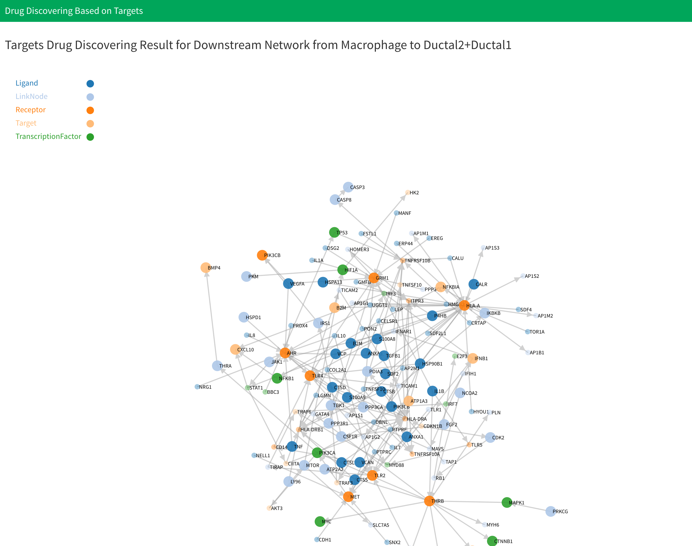
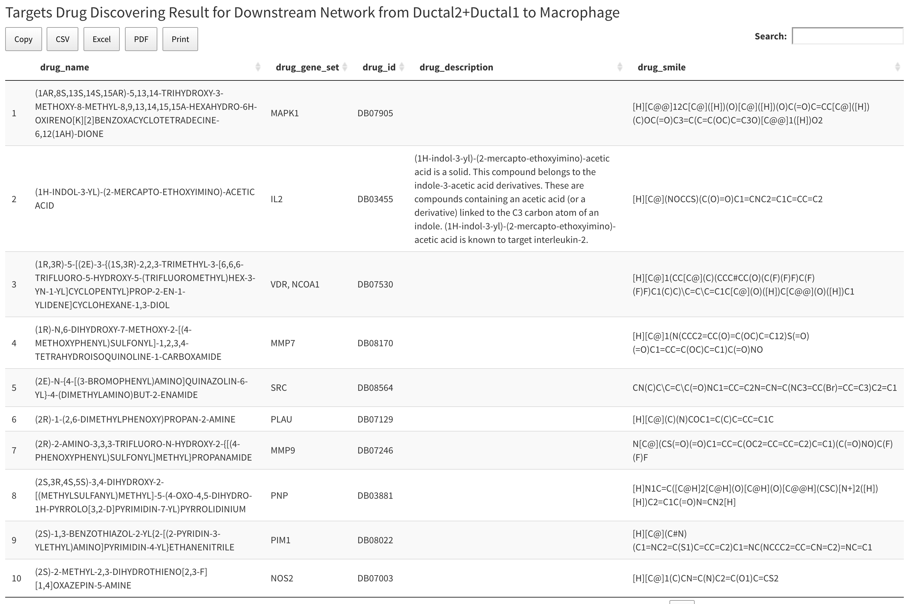
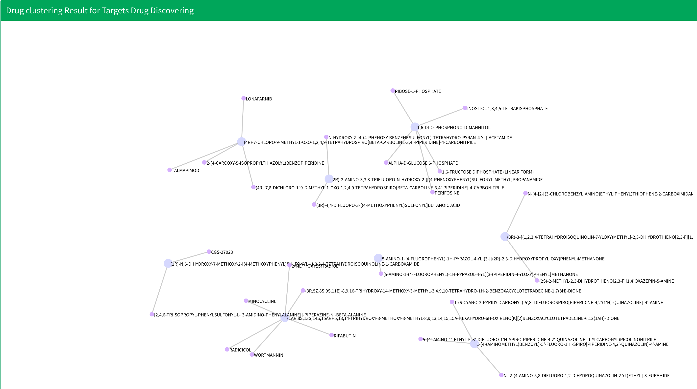

# Drug Discovering and Clustering Based on Target and Chemical Structure

## Introduction

This analysis is located in the "Communication and Drug" section. The 'Drug Discovery and Clustering based on Targets and Chemical Structure' analysis helps identify potential drugs to inhibit the signaling communication network, leveraging the drug targets and their chemical structures.

This section is calculated concurrently with the signaling communication network discovery. More information can be found here: [signaling communication network discovery analysis](/cell-cellCommunication.md). You don't need to do any additional operation for this analysis, just set all the parameters for the signaling communication network discovery and Drug Discovering and Clustering Based on Signaling Signatures, then click blue button  "Generate Communication Network and Drug" to start computation.

After computation, the drug discovering and clustering results will be shown after result of drug discovering and clustering based on signaling signatures. You can select to display drug discovering result for which network in here:

There will have two results: "Drug result of downstream network from cell type 1 to cell type 2" and "Drug result of downstream network from cell type 2 to cell type 1". Drug discovering result for each network will have one network plot shows the drugs discovering result for each genes in network, one table shows the information for each discovered drug and one plot shows the drug clustering result. For drug network plot, the nodes and links will be the same as what you see in corresponding downstream signaling network. However, the size of nodes represent whether this gene have drugs target on them. The big size represent this gene have at least one drug target on it. You can see the drugs target on specific gene by click the corresponding node in plot.

Below the network plot is drug summary table. The table contains all the drugs that have target gene on the network above. Table has five columns. The first column is drug name, the second column is target gene set for the drugs, the third is drug bank ID for drugs, the fourth is description of drug, and the last column is the SMILES string for the drug.

Below drug summary table is drug clustering result.  All the nodes that link by edges are from same cluster. The text in the plot shows the name of the drug. Notices that if the result have more than ten clusters, we will only display first ten clusters. 

## Data

All data for drug discovering and clustering based on targets and chemical structure will be saved in "cellCommunication." For specific cell-cell combination, data is saved in the "CellType1-CellType2" directory inside "cellCommunication." Inside the "CellType1-CellType2" file, you will see:

* "CellType1_CellType2": This directory saves data for drug discovering data of downstream signaling network from cell type 1 to cell type 2, where "CellType1" and  "CellType2" are cell types selected by the user. Inside the directory,  you can see:
  * `targetDrug.RData`: Saves all the drug discovering and clustering based on target and chemical structure analysis result in list variable `targetDrug1`. The variable has five members. The first is a drug summary table for all the drugs discovered. The second is drug network data saved in `.json` format. The third is an APcluster object saved APclustering result for discovered drugs. For more information about APcluster object, you can see [APCluster](https://cran.r-project.org/web/packages/apcluster/vignettes/apcluster.pdf). The fourth and fifth variable are nodes and edges information of drug clustering results used for display.
* "CellType2_CellType1": This directory saves data for drug discovering data of downstream signaling network from cell type 2 to cell type 1, where "CellType1" and  "CellType2" are cell types selected by the user. Inside the directory,  you can see:
  * `targetDrug.RData`: Saves all the drug discovering and clustering based on target and chemical structure analysis result in list variable `targetDrug2`. The variable has five members. The first is a drug summary table for all the drugs discovered. The second is drug network data saved in `.json` format. The third is an APcluster object saved APclustering result for discovered drugs. For more information about APcluster object, you can see [APCluster](https://cran.r-project.org/web/packages/apcluster/vignettes/apcluster.pdf). The fourth and fifth variable are nodes and edges information of drug clustering results used for display.

## Video Demonstration

<iframe width="700" height="485" src="https://www.youtube.com/embed/gEfwyLjuGUw" frameborder="0" allow="accelerometer; autoplay; clipboard-write; encrypted-media; gyroscope; picture-in-picture" allowfullscreen></iframe>

## Methodology

### Drug Discovering

 We collected 6650 drugs from the drug bank database and target genes for all the drugs. After we computed and generated cell-cell communication network, we looked through each gene in the network and searched for drugs that target this gene. Finally, we have a drug list for each gene in the cell-cell communication network which was used to create the drug summary table.

### Drug Clustering

Drug clustering for target drugs is based on the chemical structure of drugs[1]. First, we calculate fingerprint of drug by extend method. Next, construct molecule object using SMILES information of drugs using `parse.smiles` function in R package `rcdk`. Then, get fingerprint information of drug using `get.fingerprint` function in R package `fingerprint`.  Based on fingerprint of drugs, we can compute similarity between drugs by Tanimoto index. The formulation of Tanimoto index is follow:

\\[S_{A,B}=\frac{c}{a+b-c}\\]

Where \\(S_{A,B}\\) is the similarity between drug \\(A​\\) and drug \\(B​,\\) \\(a​\\) is number of bits in drug \\(A\\)​ and \\(b\\) is number of bits in drug \\(B\\)​, \\(c\\) is number of bits in both two drugs. This is done by `fp.sim.matrix` function in R package `fingerprint` and set parameter `method="tanimoto"`.

Finally, using the similarity score between two drugs, we can construct similarity matrix and use AP clustering to clustering drugs. AP clustering is done using the R package `apcluster` .

## Reference

1. Voicu, A., Duteanu, N., Voicu, M., Vlad, D. & Dumitrascu, V. The rcdk and cluster R packages applied to drug candidate selection. *J. Cheminform.* **12**, 3 (2020).

