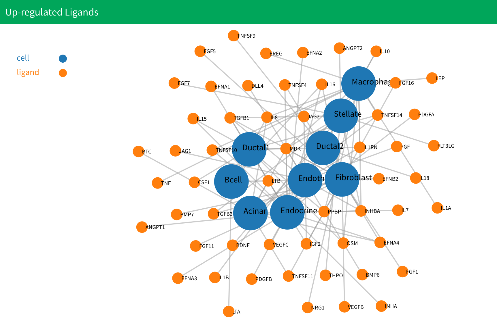
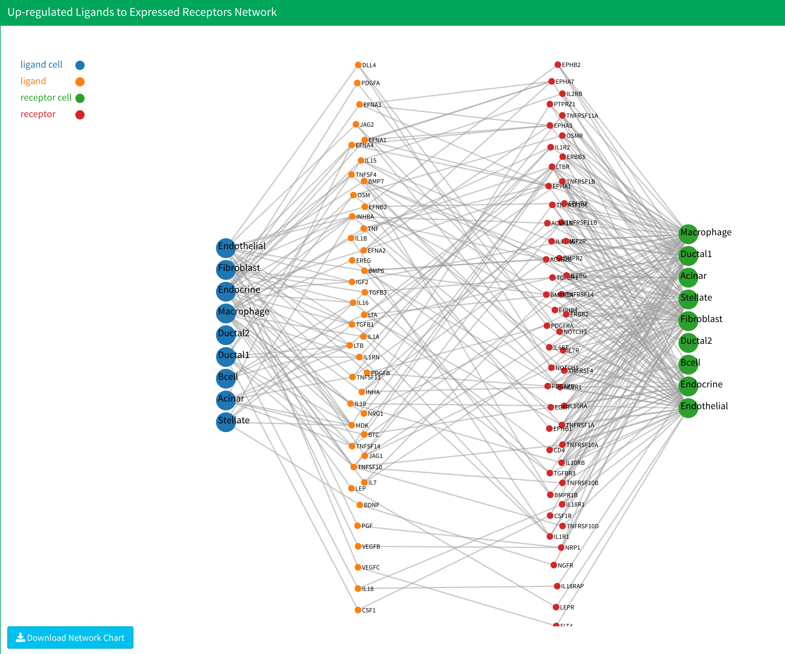

# Upstream Network Analysis

## Introduction

The upstream network analysis can be located in the "Gene Expression" section. This analysis enables you to identify up-regulated ligands and receptors for specific design or test conditions and construct a ligand-receptor interaction network using the chosen ligand-receptor interaction database. For details on selecting an interaction database, please refer to the [Set up](/setup.md) section.

<p align="center"></p>

1. In the Gene Expression part, you can find the upstream network analysis panel. Start by selecting a log fold change threshold and a p-value threshold to identify up-regulated ligands and receptors. If you've uploaded design or group data, you'll also need to define the control and test groups.

2. If you're running the upstream network analysis for a specific control-test group combination for the first time, ensure the "Use saved calculation" checkbox is unchecked. However, after the initial calculation, if you wish to modify the threshold, the application can retrieve the saved result to save on computation time by checking the "Use saved calculation" box in such cases.

3. After setting the threshold and selecting a group, click the blue "Upstream Network Analysis" button to initiate the analysis. Please note, this step is typically the most time-consuming part of the process. Ensure your computer remains operational throughout to avoid losing any results.

4.After the analysis is complete, six plots will be displayed. The first two show the up-regulated ligands and receptors. The following four represent upstream network plots:
  * Up-regulated ligands to expressed receptors, 
  * Expressed ligands to up-regulated receptors, 
  * Up-regulated ligands to up-regulated receptors, 
  * and The combined network.

  For more detailed information about these results, please refer to the methodology section.

  <p align="center"></p>

  In the up-regulated ligands and receptors plot, cells without up-regulated genes are excluded. Additionally, cells present in only one group are removed. In the upstream network plot, cells without any interactions are omitted. If no results appear after the calculation, consider reopening the application or adjusting to a more lenient threshold.

  <p align="center"></p>


## Data

All upstream network analysis data is stored in the "upRegulatedLigandsReceptors" folder in the working directory. Within this folder, results for each group combination have their own subfolder. For instance, if your test group is named "test" and control group is named "control", the results will be saved in the *control-test* folder. If you select more than one groups, such as selecting "test1" and "test2" as the test group and "control1" and "control2" as the control group, the folder will be named as *test1+test2-control1+control2*.  **We only save the latest result for each group combination**. If you don't upload group information, all results will save in the "noGroup" directory.

Within the group folder, you will find three files:

* `upRegNetwork.RData`: Saves up-regulated ligands and receptors network data in the list variable  `upReg_network`. The list has two variables. The first saves the network data for up-regulated ligands, and the second saves the network data for up-regulated receptors. You can obtain them through:

  ```R
  up_ligands_result<-upReg_network[[1]]
  up_receptors_result<-upReg_network[[2]]
  ```

  Each result is a list with three variables. The first is the network data in `.json` format. The second is the network edge list in data frame format. The third is network node data in data frame format. You can obtain them through:

  ```
  ligands_network_json<-up_ligands_result[[1]]
  ligands_network_edge<-up_ligands_result[[2]]
  ligands_network_node<-up_ligands_result[[3]]
  ```

* `upStreamNetwork.RData`:  Saves upstream network data in the list variable `upStreamData`. The list has four variables to save four upstream network data. They are the up-regulated ligands to expressed receptors network, the expressed ligands to up-regulated receptors network, a combination of the first two networks, and the up-regulated ligands to up-regulated receptors network respectively. You can obtain them through:

  ```
  up_to_exp_network<-upStreamData[[1]]
  exp_to_up_network<-upStreamData[[2]]
  combine_network<-upStreamData[[3]]
  up_to_up_network<-upStreamData[[4]]
  ```

  Each result is a list with three variables. The first is network data in `.json` format. The second is the network edge list in data frame format. The third is network node data in data frame format. You can obtain them through:

  ```
  up_to_exp_network_json<-up_to_exp_network[[1]]
  up_to_exp_network_edge<-up_to_exp_network[[2]]
  up_to_exp_network_node<-up_to_exp_network[[3]]
  ```

* You will also see `drugData.RData` and `drugBank_mapping.RData`, for more information, you can see [Drug Discovering](Drug1.md)


## Video Demonstration

<iframe width="560" height="315" src="https://www.youtube.com/embed/UoPLr3Ubad8" frameborder="0" allow="accelerometer; autoplay; clipboard-write; encrypted-media; gyroscope; picture-in-picture" allowfullscreen></iframe>


## Methodology

Upstream network analysis in sc2MeNetDrug is done in several steps: 

First, differentially expressed genes in the test or design group for each cell type are obtained based on two tests, the first being the Wilcoxon rank sum test and the second being the Likelihood-ratio test<sup>1</sup>. The genes that have log fold change values larger than the threshold and adjusted p-values for both tests less than the threshold will be selected as differentially expressed genes. The tests are done by the `FindMarkers` function in the `Seurat` package with parameters set as `test.use="wilcox"` and `test.use="bimod"` for the two tests respectively.

After obtaining the differentially expressed genes for all cell types in the data set based on the test or design group the user chose, ligands and receptors are found by searching for all differentially expressed genes that are in the ligands or receptors list in our ligands-receptors database. 

Finally, the up-stream interaction networks are generated by searching for all the ligands-receptors interactions that exist in the discovered ligands and receptors based on the database. To be specific, four networks will be generated: an up-regulated ligands to expressed receptors network, an expressed ligands to up-regulated receptors network, a combined network, and an up-regulated ligands to up-regulated receptors network. Up-regulated ligands and receptors are ligands and receptors that have log fold change values and adjusted p-values for both tests satisfying the user’s setting. Expressed ligands and receptors are ligands and receptors that have log fold change values larger than 0 and adjusted p-values for both tests that satisfy the user’s settings. The combined network combines the up-regulated and expressed ligands and receptors together. 

## References

1. McDavid, A. *et al.* Data exploration, quality control and testing in single-cell qPCR-based gene expression experiments. *Bioinformatics* **29**, 461–467 (2013).