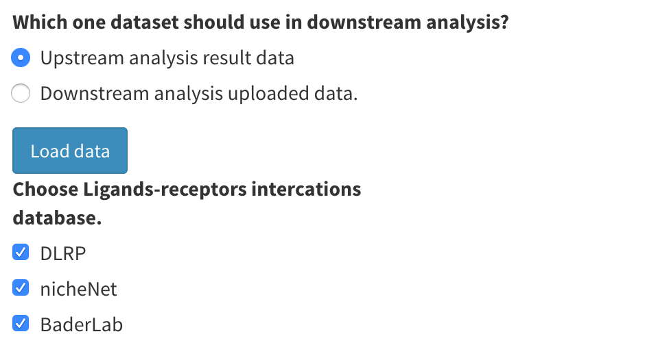

# Gene Expression, Communication and Drug Discovering (Downstream Analysis)

This part will be available after you upload data in the "Upstream analysis Data" part and finish the cell annotation part, or upload read count data and cell annotation results in the "Downstream Analysis Data" part.

First, you must specify which data you want to use for the downstream analysis. Select "Upstream analysis result data" to use the read count data and cell annotation results computed in the upstream analysis. Select “Downstream analysis uploaded data ” to use data you uploaded in the "Downstream analysis Data" part. After selecting, click the blue button "Load data" to confirm. **Notice that this setting will be applied to all the downstream analyses**.

<p align="center"></p>

You can then select a ligand-receptor interactions database. Currently, we provide three databases. The database you select will be used in all of the following analyses that use ligand and receptor data.

Notice that in order to do cell-cell communication and drug discovering analyses, you must download drug data and perform preprocessing in the application, you can find more information about this in [Working Directory Setting and Data Uploading](data.md).

Meanwhile, in order to do a differentially expressed genes test in some analyses, we will set design information for a `Seurat` object after cell annotation for "Upstream analysis data" or a `Seurat` object after preprocessing for "Downstream analysis data". If you upload group or design information, the design information set for the`Seurat` object is the combination of group and cell type. For example, if the cell belongs to "group1" and "Endothelial", the design information in `Seurat` object will be "Endothelial_group1". If you do not upload group or design information, the design information in the`Seurat` object will simply be cell type for each cell.

For "upstream analysis data", the `rna_df.RData`  will be refreshed after cell annotation. You can load data and obtain design information by:

```
library(Seurat)
Idents(seurat_data)
```

For "Downstream analysis data", after preprocessing, the design information is set and you can load `network_df.RData` in your working directory to view the design information using the following:

```
library(Seurat)
Idents(seurat_data)
```

