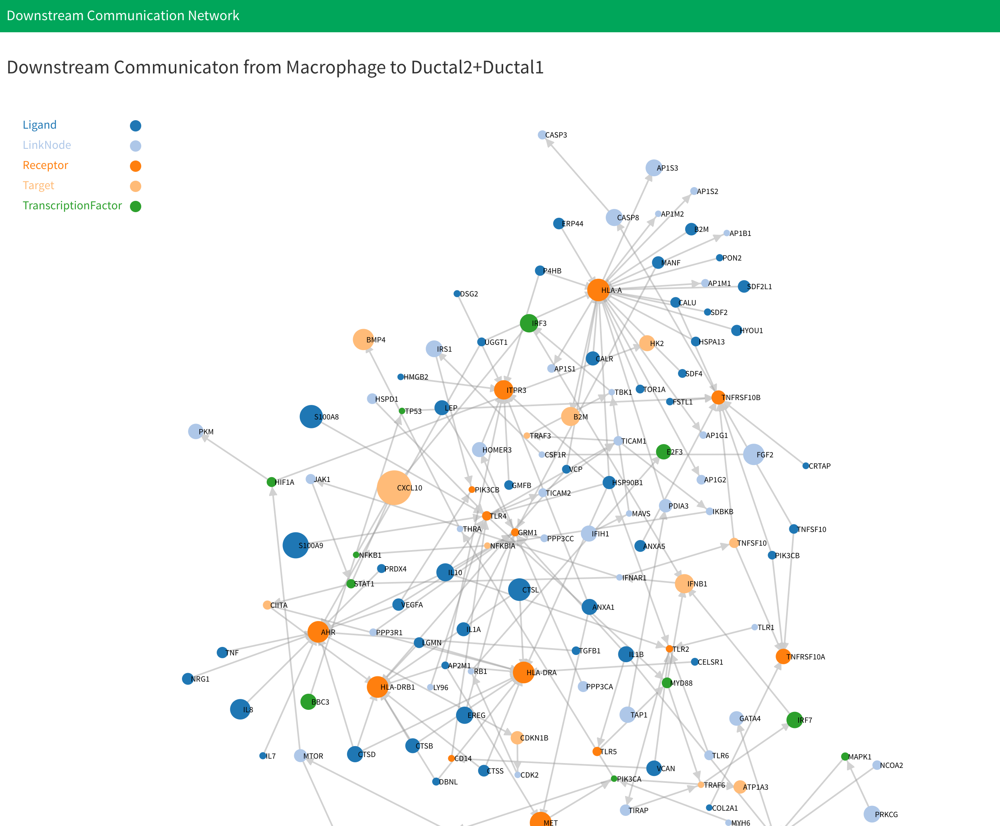
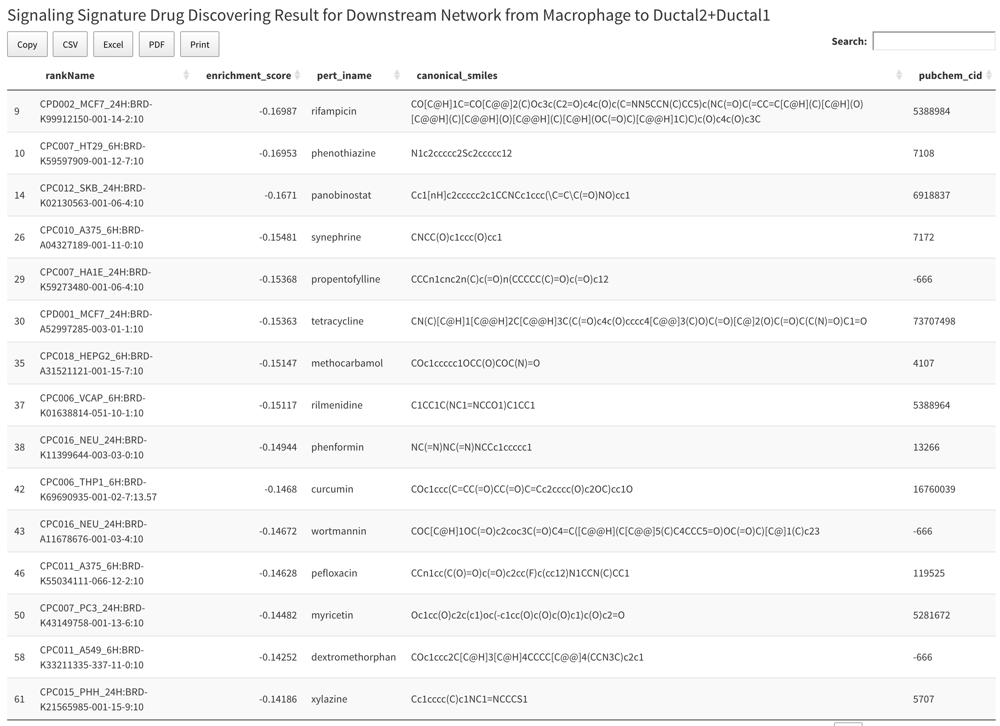

# Drug Discovering and Clustering Based on Signaling Signatures

## Introduction

You can find this analysis in the "Communication and Drug" section. Drug discovering and clustering based on signaling signatures analysis allows you to find potential drugs for diseases based on signaling signatures of drugs.

This part will be computed along with the cell-cell communication portion. More information can be found here: [cell-cell communication analysis](/cell-cellCommunication.md). Besides selecting what is needed for cell-cell communication, you need to select a number of top drugs to specify how many drug candidates you want. However, if you only want drugs that appear in the drug bank database, you can check the "Only use drug bank drug in drug discovering" check box. Next, click "Generate Communication Network and Drug" to start computation.

After computation, the results will be shown below cell-cell communication with two top drug information tables and two plots. The tables show all top drugs information for cell type 1 and cell type 2 respectively. The tables have five columns. The first column shows the rank name of the drug and the second column shows the enrichment score for the drug. The third column is the name of drug and the fourth column is SMILES information for drugs. The last column is the PubChem drug ID.

Below the tables is the drug clustering result plot. All the nodes that link by edges are from same cluster. The text in the plot shows the name of the drug and the corresponding enrichment score.

## Data

All data for drug discovering based on signaling signatures will be saved in "cellCommunication" . For specific cell-cell combination, data is saved in the "CellType1-CellType2" directory inside "cellCommunication". Inside the "CellType1-CellType2" file, you will see:

`drugData.RData`: Saves all the drug discovering and clustering based on signaling signatures analysis results in list variable `drug_discover`. The list have six members. the first and second are drug information tables for cell type1 and cell type2. The third and fourth are APcluster objects that save APclustering result for drugs of cell type1 and cell type2. For more information about APcluster object, you can see [APCluster](https://cran.r-project.org/web/packages/apcluster/vignettes/apcluster.pdf). The last two members are drug clustering result for drugs of cell type1 and cell type2 saved in `.json` format.

## Methodology

### Drug Discovering

After we get up-regulated genes for eachof the two cell types in the cell-cell communication analysis, sc2MeNetDrug will use GSEA and a drug rank matrix to discover potential drugs for each cell type. For more information about the drug rank matrix, you can see [Working Directory and Data Upload](../data.md). First, the application will compute an enrichment score for the up-regulated gene set for each drug in each cell type using the drug rank matrix. Then, the top K drugs with the lowest enrichment scores would be selected as potential drugs, where K is the number of top drugs.

### Drug Clustering

After the top drug is found, the Affinity Propagation Clustering (AP clustering)1 will be used to cluster drugs found in the drug discovering analysis. First, a similarity matrix for top drugs is constructed. If the number of top drugs is K, then the dimensions of the matrix will be $K \times K$. The similarity score for drug $i$ to drug $j$ is found by the following steps. Select the top 150 up-regulated genes and top 150 down-regulated genes for drug $i$ as the gene set. Then, compute the GSEA score for drug $j$ using the drug rank matrix and gene set from drug $i$. Then, the enrichment score will be used as the similarity score for drug $i$ to drug $j$. After constructing a similarity matrix, it is used to do AP clustering. AP clustering is done using the R package `apcluster` .

## References

1. Frey, B. & Dueck, D. Clustering by Passing Messages Between Data Points. *Science* **315**, 972–976 (2007).