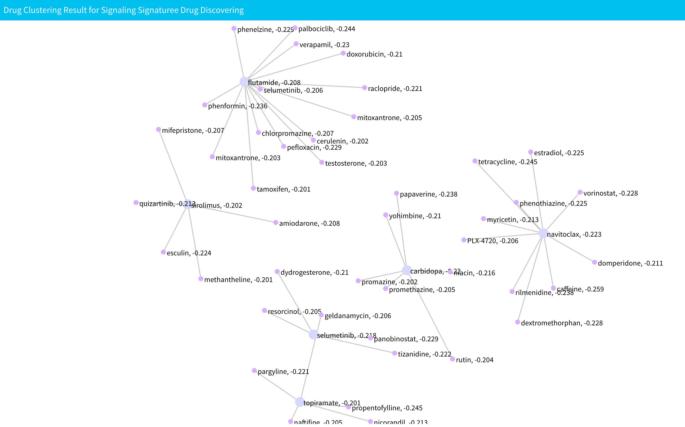

# Drug Discovering and Clustering Based on Signaling Signatures

## Introduction

You can find this analysis in the "Communication and Drug" section. Drug discovering and clustering based on signaling signatures analysis allows you to find potential drugs to inhibit signaling communication network based on the signaling signatures of drugs.

This part will be computed along with the signaling communication network discovery portion. More information can be found here: [signaling communication network discovery analysis](/cell-cellCommunication.md). Besides selecting what is needed for signaling communication network discovery, you need to select a number of top drugs to specify how many drug candidates you want in drug discovering. However, if you only want drugs that appear in the drug bank database, you can check the "Only use drug bank drug in drug discovering" check box. Next, click "Generate Communication Network and Drug" to start computation.

<p align="center"></p>

After computation, the results will be shown below network plot. You can select to display drug discovering result for which network in here:


There will have two results: "Drug result of downstream network from cell type 1 to cell type 2" and "Drug result of downstream network from cell type 2 to cell type 1". Drug discovering result for each network will have one table shows the information for each discovered drug and a plot shows the drug clustering result. The table will have five columns. The first column is rank name in CMAP data. The second column is the enrichment score for each drug. The third column is the drug name. The fourth column is the SMILE information of drug and the final column is the pubchem id for drug. 


The drug clustering result plot is show below the table. All the nodes that link by edges are from same cluster. The text in the plot shows the name of the drug and the corresponding enrichment score. Notices that if the result have more than ten clusters, we will only display first ten clusters. 

<p align="center"></p>

## Data

All data for drug discovering based on signaling signatures will be saved in "cellCommunication" directory. For specific cell-cell combination, data is saved in the "CellType1-CellType2" directory inside "cellCommunication." Inside the "CellType1-CellType2" file, you will see:

* "CellType1_CellType2": This directory saves data for drug discovering data of downstream signaling network from cell type 1 to cell type 2, where "CellType1" and  "CellType2" are cell types selected by the user. Inside the directory,  you can see:

  * `signalingDrug.RData`: Saves all the drug discovering and clustering results in variable `signalingDrug1`. The variable is a list. The first variable in list is drug table saves all the information for discovered drugs. The second variable in list is APCluster object saves APclustering results of discovered drugs. The third and fourth variable are nodes and edges information of drug clustering results used for display. For more information about APcluster object, you can see [APCluster](https://cran.r-project.org/web/packages/apcluster/vignettes/apcluster.pdf). You can access them by following codes:

    ```R
    drug_table1<-signalingDrug1[[1]]
    drug_clustering_result1<-signalinDrug1[[2]]
    drug_clustering_nodes1<-signalingDrug1[[3]]
    drug_clustering_edges1<-signalingDrug1[[4]]
    ```

* "CellType2_CellType1": This directory saves data for drug discovering data of downstream signaling network from cell type 2 to cell type 1, where "CellType1" and  "CellType2" are cell types selected by the user. Inside the directory,  you can see:

  * `signalingDrug.RData`: Saves all the drug discovering and clustering results in variable `signalingDrug2`. The variable is a list. The first variable in list is drug table saves all the information for discovered drugs. The second variable in list is APCluster object saves APclustering results of discovered drugs. The third and fourth variable are nodes and edges information of drug clustering results used for display. For more information about APcluster object, you can see [APCluster](https://cran.r-project.org/web/packages/apcluster/vignettes/apcluster.pdf). You can access them by following codes:

    ```R
    drug_table2<-signalingDrug2[[1]]
    drug_clustering_result2<-signalinDrug2[[2]]
    drug_clustering_nodes2<-signalingDrug2[[3]]
    drug_clustering_edges2<-signalingDrug2[[4]]
    ```

    

## Methodology

### Drug Discovering

After we get up-regulated genes for each of the two cell types in the signaling communication network analysis, sc2NetDrug will use GSEA and a drug rank matrix to discover potential drugs for each network. For more information about the drug rank matrix, you can see [Working Directory and Data Upload](../data.md). First, for specific downstream signaling network, all the genes in the network will be selected as target gene set. Then, the enrichment score of each drugs in drugs rank database target on the target gene set will be computed using GSEA. Then, the top \\(K\\) drugs with the lowest enrichment scores would be selected as potential drugs, where \\(K\\) is the number of top drugs.

### Drug Clustering

After the top drug is found, the Affinity Propagation Clustering (AP clustering)<sup>1</sup> will be used to cluster drugs found in the drug discovering analysis. First, a similarity matrix for top drugs is constructed. If the number of top drugs is \\(K\\), then the dimensions of the matrix will be \\(K \times K​\\). The similarity score for drug ​\\(​i\\) to drug \\(j\\) is computed by the following steps. Select the top 150 up-regulated genes and top 150 down-regulated genes for drug \\(i​ \\) as the gene set. Then, compute the GSEA score for drug \\( j \\) using the drug rank matrix and gene set from drug \\(i​\\). Then, the enrichment score will be used as the similarity score for drug \\(i \\) to drug \\(j \\). After constructing a similarity matrix, it is used to do AP clustering. AP clustering is done using the R package `apcluster` .


## References

1. Frey, B. & Dueck, D. Clustering by Passing Messages Between Data Points. *Science* **315**, 972–976 (2007).