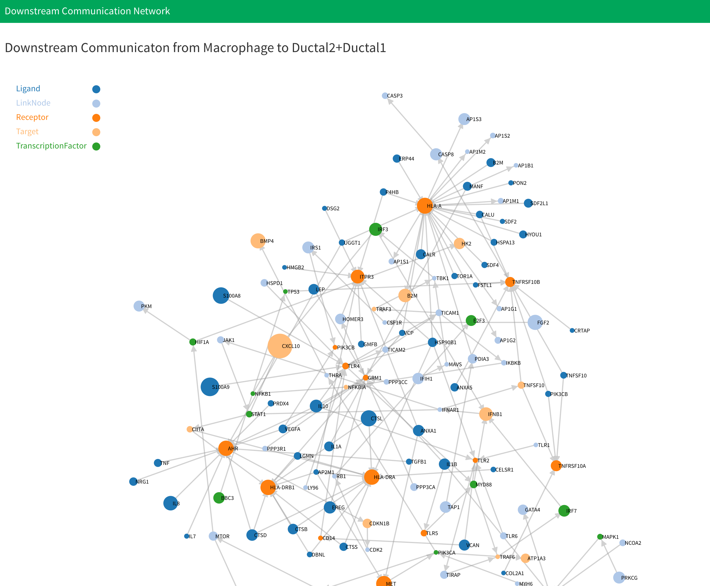
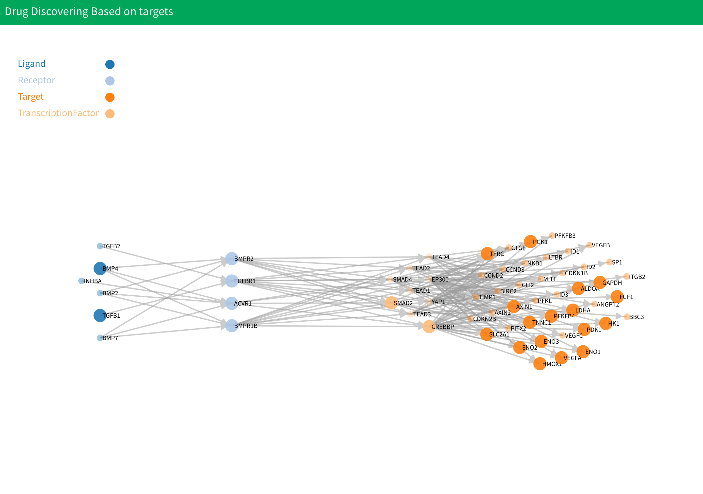
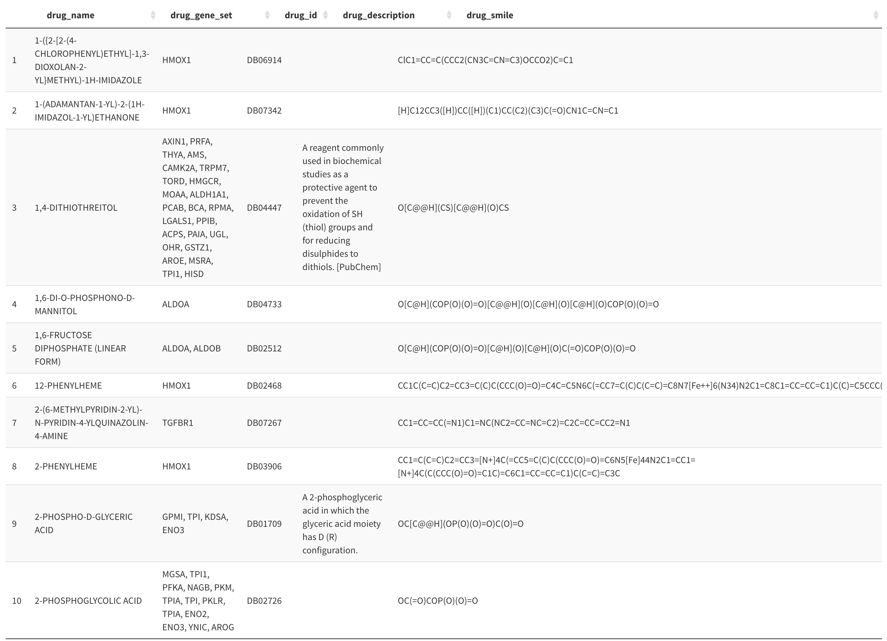
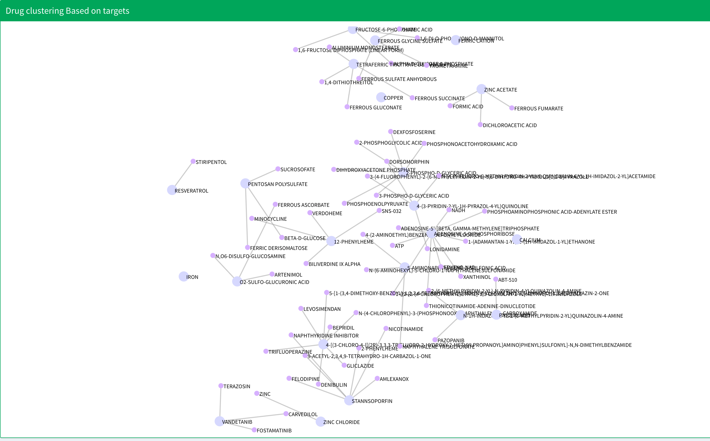

# Drug Discovering and Clustering Based on Target and Chemical Structure

## Introduction

You can find this analysis in the "Communication and Drug" section. Drug discovering and clustering based on targets and chemical structure analysis allows you to find potential drugs for diseases based on targets and chemical structure of drugs.

This part will be computed along with the cell-cell communication portion.More information can be found here: [cell-cell communication analysis](/cell-cellCommunication.md). You don't need to do any additional operation for this analysis, just set all the parameters for the cell-cell communication and Drug Discovering and Clustering Based on Signaling Signatures, then click blue button  "Generate Communication Network and Drug" to start computation.

After computation, the drug discovering and clustering results will be shown after signaling signatures based drug clustering. Drug discovering is based on the result of cell-cell communication. For each communication network, there will be three results. The first is a drug network plot where the genes and edges in network are equal to cell-cell communication network. But here the size and transparency of genes indicate whether specific nodes have drug target. A larger gene size and less transparency indicate this gene has the drug target. You can view the drug list for specific gene by click the node in plot. 

Below the network plot is drug summary table. The table contains all the drugs that have target gene on the network above. Table has five columns. The first column is drug name, the second column is target gene set for the drugs, the third is drug bank ID for drugs, the fourth is description of drug, and the last column is the SMILES string for the drug.

Below drug summary table is drug clustering result.  All the nodes that link by edges are from same cluster. The text in the plot shows the name of the drug.

## Data

All data for drug discovering and clustering based on targets and chemical structure will be saved in "cellCommunication." For specific cell-cell combination, data is saved in the "CellType1-CellType2" directory inside "cellCommunication." Inside the "CellType1-CellType2" file, you will see:

* "CellType1_CellType2": This directory saves data for drug discovering data from cell type 1 to cell type 2 communication network, where "CellType1" and  "CellType2" are cell types selected by the user. Inside the directory,  you can see:
  * `targetDrug.RData`: Saves all the drug discovering and clustering based on target and chemical structure analysis result in list variable `targetDrug1`. The variable has four members. The first is a drug summary table for all the drugs discovered in cell type1 to cell type2 communication network. The second is drug network data saved in `.json` format. The third is an APcluster object saved APclustering result for drugs. For more information about APcluster object, you can see [APCluster](https://cran.r-project.org/web/packages/apcluster/vignettes/apcluster.pdf). The final is drug clustering result saved in `.json` format.
* "CellType2_CellType1": This directory saves data for drug discovering data from cell type 2 to cell type 1 communication network, where "CellType1" and  "CellType2" are cell types selected by the user. Inside the directory,  you can see:
  * `targetDrug.RData`: Saves all the drug discovering and clustering based on target and chemical structure analysis result in list variable `targetDrug2`. The variable has four members. The first is drug summary table for all the drugs discoverd in cell type2 to cell type1 communication network. The second is drug network data saved in `.json` format. The third is APcluster object saved APclustering result for drugs. For more information about APcluster object, you can see [APCluster](https://cran.r-project.org/web/packages/apcluster/vignettes/apcluster.pdf).The final is drug clustering result saved in `.json` format.

## Methodology

### Drug Discovering

 We collected 6650 drugs from the drug bank database and target genes for all the drugs. After we computed and generated cell-cell communication network, we looked through each gene in the network and searched for drugs that target this gene. Finally, we have a drug list for each gene in the cell-cell communication network which was used to create the drug summary table.

### Drug Clustering

Drug clustering for target drugs is based on the chemical structure of drugs[1]. First, we calculate fingerprint of drug by extend method. Next, construct molecule object using SMILES information of drugs using `parse.smiles` function in R package `rcdk`. Then, get fingerprint information of drug using `get.fingerprint` function in R package `fingerprint`.  Based on fingerprint of drugs, we can compute similarity between drugs by Tanimoto index. The formulation of Tanimoto index is follow:

\\[S_{A,B}=\frac{c}{a+b-c}\\]

Where \\(S_{A,B}\\) is the similarity between drug \\(A​\\) and drug \\(B​,\\) \\(a​\\) is number of bits in drug \\(A\\)​ and \\(b\\) is number of bits in drug \\(B\\)​, \\(c\\) is number of bits in both two drugs. This is done by `fp.sim.matrix` function in R package `fingerprint` and set parameter `method="tanimoto"`.

Finally, using the similarity score between two drugs, we can construct similarity matrix and use AP clustering to clustering drugs. AP clustering is done using the R package `apcluster` .

## Reference

1. Voicu, A., Duteanu, N., Voicu, M., Vlad, D. & Dumitrascu, V. The rcdk and cluster R packages applied to drug candidate selection. *J. Cheminform.* **12**, 3 (2020).

