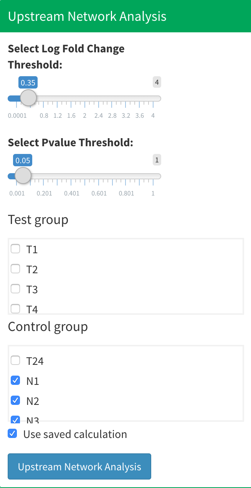
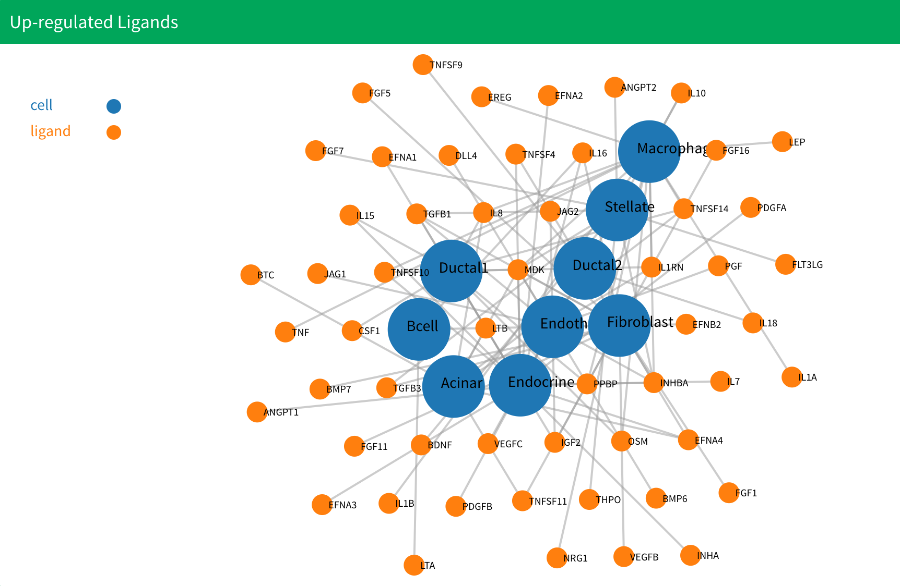
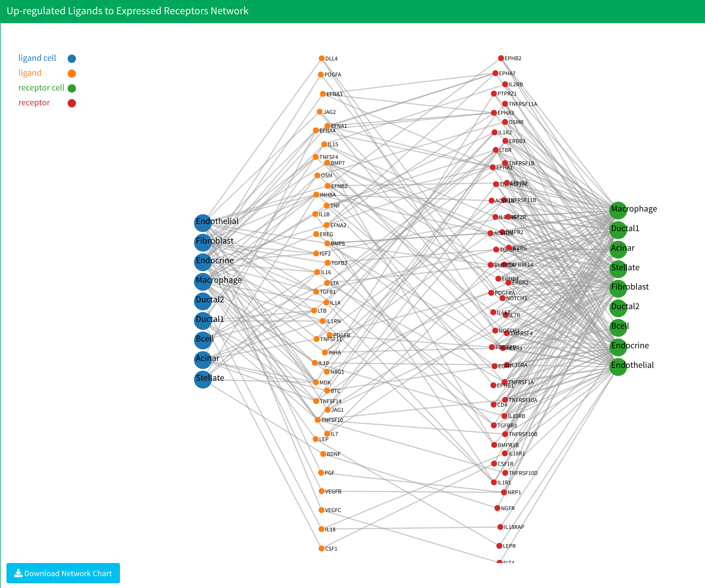

# Upstream Network Analysis

## Introduction

You can find the upstream network analysis in the "Gene Expression" section. Upstream network analysis allows you to find up-regulated ligands and receptors for certain design or test conditions and generate a ligand-receptor intercation network based on the ligand-receptor intercation database. For choosing a ligand-receptor intercation database, see [Set up](/setup.md).

<p align="center"></p>

In the Gene Expression part, you can find the upstream network analysis frame. First, you need to select a log fold change threshold and a p-value threshold to discover up-regulated ligands and receptors. If you upload design or group information, you also need to specify the control group and test group.. If it is the first time you run the upstream network analysis for a certain control-test group combination, you should check the "Use saved calculation" check box. Once you have calculated once and want to adjust the threshold, the application can automatically look for the saved result and conserve calculation time. After you choose the threshold and group, click the blue button "Upstream Network Analysis" to start upstream network analysis. **Normally, this part is the most time-costly part of the analysis, thus it is important to make sure your computer can keep running properly for a long time before clicking, otherwise you may lose results.**

<p align="center"></p>

After computation, there will be six total plots. The first two are the up-regulated ligands and up-regulated receptors. The next four plots are the upstream network plots. They are up-regulated ligands to expressed receptors, expressed ligands to up-regulated receptors, up-regulated ligands to up-regulated receptors, and the combined network.

<p align="center"></p>

In the up-regulated ligands and receptors plot, all the cells that don't have up-regulated genes will be deleted from plot. In addition, cells that only exist in one of the groups will be deleted. In the upstream network plot, all the cells that don't have intercation will be deleted. **If you don't see anything after the calculation, try to reopen the application or set a loose threshold.**

## Data

All the data for upstream network analysis is saved in the "upRegulatedLigandsReceptors" directory within the working directory. Inside the directory, each group combinations has their own directory to save results. For example, if your test group is named "test" and control group is named "control", the resulst will be saved in the directory as *control-test*. If you have more than one group in the test or control, like "test1" and "test2" in the test group and "control1" and "control2" in the control group, the directory will be named as *test1+test2-control1+control2*.  **We only save the latest result for each group combination**, please be careful. If you don't upload group information, the results will save in the "noGroup" directory.

Inside the group directory, you will see three files:

* `genesInformation.RData`：Saves the log fold change and p-value information used for the differentially expressed genes test in the list variable `genesInformation`. You can use the cell type name to get the corresponding result, for example:

  ```R
  endotelial_result<-genesInformation[["Endothelial"]]
  ```

  The name of the cell type is equal to the name displayed in the application and only cell types that exist in both the test and control group will be kept. Meanwhile, only genes that have positive log fold change values will be kept.

  The result is a dataframe, with the first column as the log fold change and the second and third columns as the expression percentages in the test and control groups respectively. The fourth and fifth columns are Wilcoxon rank sum test adjusted p-values and bimod test adjusted p-values based on the Bonferroni correction. You can obtain them through:

  ```R
  log_fc<-endotelial_result[,1]
  pct1<-endotelial_result[,2]
  pct2<-endotelial_result[,3]
  wlicox_p<-endotelial_result[,4]
  wilcox_p_adjust<-endotelial_result[,5]
  bimod_p<-endotelial_result[,6]
  bimod_p_adjust<-endotelial_result[,7]
  ```

  For more information about the table, you can check the [Seurat website](https://satijalab.org/seurat/v3.1/de_vignette.html).

* `upRegNetwork.RData`: Saves up-regulated ligands and receptors network data in the list variable  `upReg_network`. The list has two variables. The first saves the network data for up-regulated ligands, and the second saves the network data for up-regulated receptors. You can obtain them through:

  ```R
  up_ligands_result<-upReg_network[[1]]
  up_receptors_result<-upReg_network[[2]]
  ```

  Each result is a list with three variables. The first is the network data in `.json` format. The second is the network edge list in data frame format. The third is network node data in data frame format. You can obtain them through:

  ```
  ligands_network_json<-up_ligands_result[[1]]
  ligands_network_edge<-up_ligands_result[[2]]
  ligands_network_node<-up_ligands_result[[3]]
  ```

* `upStreamNetwork.RData`:  Saves upstream network data in the list variable `upStreamData`. The list has four variables to save four upstream network data. They are the up-regulated ligands to expressed receptors network, the expressed ligands to up-regulated receptors network, a combination of the first two networks, and the up-regulated ligands to up-regulated receptors network respectively. You can obtain them through:

  ```
  up_to_exp_network<-upStreamData[[1]]
  exp_to_up_network<-upStreamData[[2]]
  combine_network<-upStreamData[[3]]
  up_to_up_network<-upStreamData[[4]]
  ```

  Each result is a list with three variables. The first is network data in `.json` format. The second is the network edge list in data frame format. The third is network node data in data frame format. You can obtain them through:

  ```
  up_to_exp_network_json<-up_to_exp_network[[1]]
  up_to_exp_network_edge<-up_to_exp_network[[2]]
  up_to_exp_network_node<-up_to_exp_network[[3]]
  ```

* You will also see `drugData.RData` and `drugBank_mapping.RData`, for more information, you can see [Drug Discovering](Drug1.md)

## Methodology

Upstream network analysis in SC2NetDrug is done in several steps: 

First, differentially expressed genes in the test or design group for each cell type are based on two tests, the first being the Wilcoxon rank sum test and the second being the Likelihood-ratio test<sup>1</sup>. The genes that have log fold change values larger than the threshold and adjusted p-values for both tests less than the threshold will be selected as differentially expressed genes. The tests are done by the `FindMarkers` function in the `Seurat` package with parameters set as `test.use="wilcox"` and `test.use="bimod"` for the two tests respectively.

After we the differentially expressed genes for all cell types in the data set based on the test or design group the user chose are obtained, ligands and receptors are found by searching for all differentially expressed genes that are in the ligands or receptors list in our ligands-receptors database. 

Finally, the up-stream interaction networks are generated by searching for all the ligands-receptors interactions that exist in the discovered ligands and receptors based on the database. To be specific, four networks will be generated: an up-regulated ligands to expressed receptors network, an expressed ligands to up-regulated receptors network, a combined network, and an up-regulated ligands to up-regulated receptors network. Up-regulated ligands and receptors are ligands and receptors that have log fold change values and adjusted p-values for both tests satisfying the user’s setting. Expressed ligands and receptors are ligands and receptors that have log fold change values larger than 0 and adjusted p-values for both tests that satisfy the user’s settings. The combined network combines the up-regulated and expressed ligands and receptors together. 

## References

1. McDavid, A. *et al.* Data exploration, quality control and testing in single-cell qPCR-based gene expression experiments. *Bioinformatics* **29**, 461–467 (2013).